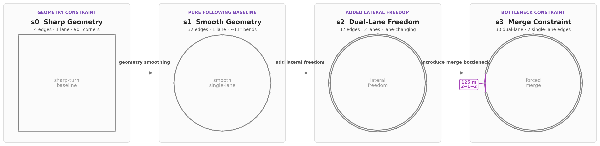

# CAV Mixed-Traffic Lab

> A reproducible SUMO platform for CAV/HV mixed-traffic experiments: how CAV penetration and car-following control affect **observed flow, safety, emissions, and reference-relative lap time** under different road constraints — validated on a **7,524-run formal grid (3×3 dual seeds)** with a statistical analysis layer (dual benefit phase diagrams, benefit boundaries, Pareto fronts).

> **Project identity:** renamed from *CAV Multi-level Penetration Simulation* after
> v0.4.2. The v0.4.2 tag, release and formal reports retain the name under which
> they were published; code, data schemas and scientific results are unchanged.

`SUMO 1.27.1` · `Python 3.10+` · `7,524 simulations · 3×3 dual seeds` · `v0.4.2`

[What Changed vs v0.4.0.post3](#v042-what-changed-vs-v040post3) ·
[Key Findings](#key-findings) ·
[Core Results](#core-results) ·
[Experiment Design](#experiment-design) ·
[Metric Methodology](#metric-methodology) ·
[Quick Start](#quick-start) ·
[Report (中文)](docs/report.cn.md) ·
[Report (English)](docs/report.en.md) ·
[Release Checklist](docs/engineering/release-checklist.md)

---

## v0.4.2: What Changed vs v0.4.0.post3

v0.4.2 is the first public release after v0.4.0.post3 (the frozen 10,080-run reanalysis). v0.4.1 was an internal milestone and was **not released**; its engineering outcomes are folded into v0.4.2. The evaluation framework (four dimensions: flow / safety / emissions / efficiency) and the s0→s1→s2→s3 scenario chain carry over; the experiment itself was redesigned and re-run.

### Improvements over v0.4.0.post3

- **Exact `cav_count` grid** — repairs the v0.4.0 requested-pCAV discretization defect (integer CAV counts at 0.1-step penetration levels).
- **Space-matched safety exposure** — `withInternal="true"` edgeData: whole-network TTC events over whole-network veh-km (v0.4.0 safety events were not matched to their exposure scope).
- **HV/CAV subgroup decomposition** — detector/edgeData/SSM/vehroute/lanechange/stderr + FCD physical time headway, delivered as a run-level subgroup long table.
- **Independent 3×3 dual seeds** — vehicle-type assignment seeds and SUMO stochastic seeds are separated and both recorded.
- **P0 insertion-defect fix** — `departSpeed="0"` (stationary insertion) eliminates the high-density insertion loss of `departSpeed="max"`; a hard insertion-integrity guard (`vehicles < vehN` → `INVALID_DATA`) prevents silent recurrence.
- **Safety merged into the main grid** — SSM acquisition runs for all 7,524 runs (previously a separate 84-run safety sub-grid).
- **Dual emission scopes** — non-internal primary estimand (definition-level comparable to v0.4.0) plus a whole-network secondary intensity.
- **Fundamental-diagram scheme** — the density axis spans free-flow → critical → congested (up to 37.5% of jam density, "limited high-density reach"), producing capacity FDs per scenario instead of isolated operating points.

### Redesigned experiment parameters (core differences)

| Aspect | v0.4.0.post3 | v0.4.2 (U55) |
|---|---|---|
| Grid | 10,080 runs, requested-pCAV levels | **7,524 runs**, exact `cav_count` grid |
| Density axis | 5–60 veh/km/lane nominal | **5–55 veh/km/lane** unified (s0/s1 10–110, s2/s3 20–220) |
| Seeds | 5 assignment seeds | **3×3 dual seeds** |
| Exposure scope | Non-internal edges | Whole-network (space-matched) |
| Simulation window | `[600, 3600)` | **[600, 1800)** (warmup 600 s, calibrated stable ≤120 s) |
| Insertion | `departSpeed="max"` | `departSpeed="0"` (defect fixed) |
| Safety acquisition | Separate sub-grid | Merged into the main grid (SSM on) |
| Subgroups | Model-level only | HV/CAV long table + FCD THW |

**Definition-level comparability.** The primary CO₂ estimand keeps the same definition, so the two versions are comparable at the definition level. However, the acquisition pipeline, `withInternal` handling, seed design and simulation window differ — the two grids are **not numerically interchangeable**, and no cross-version numeric-consistency or change-rate inference is drawn.

---

## Research Question

> **Do the observed-flow gains of CAV car-following control come with safety, emission, or travel-time costs?**

The project compares **IDM** and **CACC** across four progressively constrained road structures. Rather than asking which model is universally better, it asks:

> **Which control strategy performs better under which road structure and traffic density?**

---

## Scenario Design

The four scenarios support three structured scenario comparisons:

- `s0 → s1`: geometry smoothing;
- `s1 → s2`: a transition to two lanes with added lateral freedom and lower per-lane density at fixed `vehN`;
- `s2 → s3`: introduction of a 125 m `2→1→2` merge bottleneck.



*From left to right, the scenarios progressively change geometry, lane count/lateral freedom, and merge constraints. These comparisons do not isolate a single causal factor.*

s0/s1 are single-lane 2.0 km loops, s2/s3 dual-lane 2.0 km loops. vehN axes are density-aligned (s0/s1 10–110 step 10; s2/s3 20–220 step 20 → 5–55 veh/km/lane per lane). s3 uses the v0.3.1 geometry (32-gon, single-lane 125 m bottleneck on e15/e16) driven by `net.json` metadata; its fundamental diagram is a **bottleneck queue–throughput relation**, not a mainline fundamental diagram, and is charted separately.

---

## Key Findings

### 1. CACC raises the observed peak flow in unconstrained networks

In smooth, unconstrained networks, CACC reaches higher per-lane grid-observed maxima at full penetration: s1 **4,689 veh/h/lane** (vs IDM 3,918, both at upper density cells) and s2 **4,694 veh/h/lane** (vs IDM 3,916; both-lane totals 9,387 vs 7,833). The FD peak shifts with penetration as designed: HV-only peaks at k≈20, CACC p=1.0 at k≈40, IDM p=1.0 at k≈50 (grid-observed maximum — the IDM branch shows no falling edge inside the axis cap of 55 = 37.5% of jam density).

> This benefit is scenario-dependent and does not persist under the merge constraint in s3.

### 2. The advantage reverses at a high-density merge bottleneck

In scenario **s3** at the top density (k=55, vehN=220, full CAV):

| Model | Flow (veh/h/lane) | Mean lap-time difference from reference | CO₂ intensity | TTC rate (/1,000 veh-km) |
|---|---:|---:|---:|---:|
| IDM | **1,620** | **182 s** | 339 g/veh-km | 1,328 |
| CACC | 756 | 442 s | 633 g/veh-km | 2,026 |

At this fixed high-density operating point, IDM carries approximately **2.1 times** the flow of CACC while producing a much smaller reference-relative lap-time difference, lower CO₂ intensity and lower TTC rate — the high-density forced-merge reversal holds.

> These values describe the k=55 operating point. Within the tested grid, s3 peak total flows are 3,903 veh/h (IDM, k20) and 2,583 veh/h (CACC, k15); s3 efficiency metrics at k≥40 are subject to a lap-count selection bias and are used directionally only (see Limitations).

### 3. TTC conflicts concentrate around geometric and topological constraints

Under the current `TTC < 3.0 s` SSM configuration:

- s0 contains frequent conflicts associated with periodic sharp-turn braking (≈100% of runs);
- s1 contains relatively few conflicts (161/1,881 runs, 9%), s2 333/1,881 (18%) — both concentrated at k≥35, with CACC rates above IDM at high density;
- s3 contains dense conflict activity around forced merging (96% of runs, 14,989 emergency-braking events).

The observed distribution is consistent with road geometry and loss of lateral freedom being major contributors to conflict formation.

> This interpretation is limited to the current SSM threshold, model parameters, and experiment grid. TTC events have not yet been independently reproduced from FCD or TraCI trajectories.

---

## Core Trade-off


*CACC achieves higher throughput in smooth, unconstrained networks, but the same advantage does not transfer to a dense merge bottleneck — and high-density CACC operation carries higher safety and emission costs where it does not help.*

---

## Why This Matters

Earlier versions of the project primarily evaluated CAV performance through **traffic capacity**. Capacity alone, however, cannot determine whether a traffic state is also safe, energy-efficient, or time-efficient.

This project extends the evaluation framework to four dimensions:

| Dimension | Primary metric | Supporting metrics |
|---|---|---|
| Flow performance | Traffic flow and maximum observed flow within the tested grid | Mean speed and temporal speed variance |
| Safety | TTC conflicts per 1,000 whole-network veh-km | Minimum TTC, DRAC, emergency braking and lane-change gaps |
| Emissions | CO₂ g/non-internal-edge veh-km | NOx, PMx and fuel consumption |
| Efficiency | Mean lap-time difference from fixed reference | P95 reference difference, lap-time variation and time loss |

The results indicate that **no single car-following model is globally optimal across road structures**. CACC performs strongly in smooth and unconstrained environments, while its high-throughput regime can deteriorate under forced merging.

---

## Core Results

### Maximum Observed Flow Within the Tested Grid

Per-lane grid-observed maxima (veh/h/lane):

| Scenario | IDM | @vehN/k | CACC | @vehN/k |
|---|---:|---|---:|---|
| s0 | 1,794 | 80 / k40 | 1,857 | 80 / k40 |
| s1 | 3,918 | 100 / k50 | 4,689 | 80 / k40 |
| s2 | 3,916 (both lanes 7,833) | 200 / k50 | 4,694 (both lanes 9,387) | 160 / k40 |
| s3 | 1,952 (both lanes 3,903) | 80 / k20 | 1,292 (both lanes 2,583) | 60 / k15 |

CACC has higher observed maxima in s1 and s2 under high CAV penetration. s0 is a corner-limited baseline: HV-only flattens at ≈940 veh/h/lane for k≥20 (the 90° turns cap throughput below the 2,400 veh/h/lane τ limit), while full-CAV reaches 1,794 (IDM) / 1,857 (CACC) at k40. The s3 bottleneck reduces the grid-observed maximum relative to s2, and IDM performs better than CACC at the highest tested density.


### Safety–Flow Trade-off

The main safety metric is:

```text
whole-network TTC conflict events / 1,000 whole-network vehicle-km
```

This exposure-normalized value is space-matched (numerator and denominator share the whole-network scope). TTC-detected runs: s0 1,875/1,881 (≈100%), s1 161/1,881 (9%), s2 333/1,881 (18%), s3 1,807/1,881 (96%); s1/s2 detections concentrate at k≥35, with CACC exceeding IDM at high densities (s2 CACC up to ≈2,475 vs IDM ≈2 events/1,000 veh-km). Emergency braking concentrates in s3 (14,989 events, max 44/run). SSM mirror deduplication is an analysis heuristic (one-to-one at ≥80% overlap) — absolute counts are not exact physical conflict totals.

### CO₂–Flow Trade-off

CO₂ intensity (non-internal estimand): s0 337–462, s1 144–330, s2 146–305, s3 176–661 g/veh-km. At high densities CACC exceeds IDM on s2/s3 — the emission cost of the bottleneck-reversal regime.


### Lap-Time Difference From the Fixed Reference

At the density-aligned k=30 operating point, reference-relative lap differences: s0 full-CAV ≈22–25 s, s1/s2 ≈0–8 s; s3 full-CAV IDM 72 s vs CACC 203 s (bottleneck congestion).


### Scenario-Dependent Summary

The FD peak shifts with penetration (s1/s2): HV-only k≈20 → CACC p=1.0 k≈40, consistent in direction with the theoretical critical densities (HV 17.4 / CAV 39.2 veh/km/lane); the IDM p=1.0 branch rises to k≈50 then plateaus (grid-observed maximum, axis cap 55 = 37.5% of jam density). s3 is charted separately as a bottleneck queue–throughput relation (reference lines omitted — not comparable to mainline FDs).


### Benefit Phase Diagrams

The v0.4.2 analysis layer (`scripts/analysis/`) derives its results **from the shipped aggregated results CSV alone** (the single formal-grid data source; no additional simulation) and adds a **dual phase diagram** read side by side without forcing a single baseline:

- **Model Effect Surface** — Δq_model = q_CACC,p − q_IDM,p (same-penetration model contrast);
- **Absolute Benefit Surface** — Δq_abs = q_CACC,p − q_HV,0 (absolute benefit over the pure-HV baseline).


Highlights (statistical stance: n=9 interior cells, effect size + descriptive intervals + cross-seed consistency — not formal significance tests; thresholds are step intervals, e.g. `p* ∈ (0.5, 0.6]`):

- s0/s1/s2 show no s3-style all-level reversal (strict status sense: s0 all levels gain/mixed; s1/s2 5 gain + 4 mixed + 2 no-crossing) — but s1/s2 high-density k≥45 levels also lose at every penetration; the negative equal-weight Δq_model mean coexists with higher grid-observed peaks (peak vs mean estimands differ).
- **s3 bottleneck reversal**: high densities k∈{30,40,45,50} invert for any p≥0.2 (`p* ≤ 0.1`, `p_reversal_start ∈ (0.1,0.2]`; p=0.1 marginal cell: positive point estimate, CI crosses 0); reversal densities k* = (5,10]–(30,35] depending on p; p∈{0.2,…,0.7} never gain. Cohen's d median −2.74 (large; deterministic zero-variance cells excluded and flagged).
- Pareto (max flow / min delay / min conflict / min CO₂, no hand-picked weights, within-density comparison): no single globally optimal penetration — all four fronts span [0,1.0], but the s3 front is the smallest (60) and skews low-to-mid p (front pCAV mean 0.473, p≥0.6 share 33.3% vs s0/s1/s2 59–77%): high-p CACC is dominated at the bottleneck. Different scenarios have different Pareto-optimal regions.
- Threshold conclusions are robust to estimand choice (109/132 cells unchanged; breakdown: flow total/per-lane 44/44 scale-consistency — invariant by construction, delay mean/p95 34/44, TTC/DRAC 31/44).

Full results: report §5.1 ([中文](docs/report.cn.md) / [English](docs/report.en.md)); analysis artifacts: `out/analysis/` (descriptive deltas, effect sizes, p*/k* tables, Pareto fronts, sensitivity), chart above in `graph/v0.4.2/`.

---

## Experiment Design

- **Grid**: 7,524 runs — 4 scenarios × 11 vehN levels × 171 runs/treatment.
- **Density axis**: unified 5–55 veh/km/lane (s0/s1 single-lane vehN 10–110 step 10; s2/s3 dual-lane 20–220 step 20); cap 55 = 37.5% of jam density, set by the measured s2 SSM memory boundary (v220 probe 22.67 GiB).
- **Penetration**: cav_count 0.1 step, 11 levels (all integers); endpoint assignment deactivated by sentinel.
- **Seeds**: 3 × 3 dual seeds (assignment_seed × sumo_seed; interior n=9, endpoint n=3).
- **Simulation window**: warmup=600 s (9-cell calibration stable ≤120 s), simulation_end=1800 s, observation window [600, 1800).
- **Insertion**: `departSpeed="0"` (stationary insertion; fixes the P0 high-density insertion loss).
- **SSM enabled for the whole grid** (merged design): TTC=3.0 s, DRAC=3.0 m/s², range=50 m, greedy mirror dedup 80%, withInternal=true.
- **FCD**: 1 s profile with leader attributes (physical THW).
- Detailed design rationale, measurement scope and report boundaries: see Report §2 / §8 ([中文](docs/report.cn.md) / [English](docs/report.en.md)).

---

## Metric Methodology

### v0.4.2 measurement scope

The v0.4.2 grid uses `withInternal="true"` edgeData, so the safety event numerator and the vehicle-kilometre denominator share the same spatial scope (whole network including junction internal edges). Emissions are accumulated under two paired scopes: the primary intensity is non-internal-edge CO₂ g / non-internal-edge veh-km (the same estimand definition as v0.4.0, so the two versions are intended to be comparable at the definition level), and a secondary whole-network intensity is reported alongside (`whole_network_*` columns).

### Why use SUMO SSM for TTC?

SUMO already knows the road topology, lane relationships and conflict participants. Using SSM avoids reconstructing leader–follower relationships from global Cartesian coordinates on curved and merging roads.

### Why normalize by vehicle-kilometres?

Different vehicle counts and congestion states produce different total travelled distances. Raw event or emission totals are therefore not directly comparable.

### Why use `vehroute exitTimes` for lap time?

In a closed-loop network, unfinished trip duration represents the time a vehicle exists in the simulation, not the duration of one completed lap. Lap times are reconstructed from successive route-edge exit times.

### Why distinguish `0` and `NaN`?

```text
0   = the source was parsed successfully and no event occurred
NaN = the source was missing, invalid, inapplicable or could not be parsed
```

Detailed definitions are documented in the source (see `scripts/schema.py` for field definitions and `scripts/parsing/runner.py` for invariant validation).

---

## Reproducible Pipeline

```text
7,524 RunSpec
        │
        ▼
3-worker parallel SUMO (staggered memory scheduling)
        │
        ▼
independent run directories
        │
        ▼
serial seven-parser pipeline
        │
        ▼
summary.json × 7,524
        │
        ▼
single result writer
        │
        ▼
run_level_results.csv
        │
        ▼
nine-seed-pair aggregation
        │
        ▼
aggregated_results.csv
        │
        ▼
publication figures
```

| Stage | Main function | Wall time |
|---|---|---:|
| Parallel simulation | Three concurrent SUMO processes (3 workers fixed under the memory constraint) | 21.86 h (SUMO cumulative 65.53 h, parallel efficiency 3.00) |
| Serial parsing | Seven parsers and invariant validation (insertion-integrity guard) | — |
| Result writer | 7,524 summaries → run-level CSV | — |
| Aggregation | 924 groups (interior n=9, endpoint n=3) | — |

The simulation scheduler provides:

- deterministic `run_id` generation;
- isolated output directories;
- resume support with input SHA-256 integrity checks;
- atomic status files;
- timeout and cancellation handling (SIGINT → CANCELLED);
- staggered heavy-task-first scheduling (memory-aware, prevents OOM batches).

The parser pipeline provides:

- serial low-memory XML parsing;
- atomic `summary.json` and `parse_status.json`;
- resume support;
- explicit parser failure semantics (fail-closed);
- cross-metric invariant checks, including the insertion-integrity guard.

---

## Data Quality

```text
7,524 / 7,524  main-factorial simulations completed (SUCCESS)
3 / 21.86 h    3 workers / 21.86 h wall clock, 0 failures
0              INVALID parses (insertion-integrity guard passed)
0              writer exclusions
924            aggregated groups (4 scenarios × 11 vehN × 21 per-vehN)
492            automated tests passed (current gate baseline)
0              duplicate run IDs
0              invariant violations
```

Peak SSM memory (worst cell, s2 v220 full CAV): **13.64 GiB** under the 1,200 s observation window; raw output 76 GB (≈10.1 GB per 1,000 runs). Measured on a 32 GB host with WSL2 `memory=24GB, processors=16, swap=8GB`, SUMO 1.27.1.

The testing strategy contains three levels:

1. parser fixture unit tests;
2. short SUMO smoke and positive-event tests;
3. representative multi-scenario integration tests and full-grid closure checks.

---

## Quick Start

### Requirements

```bash
sumo --version
python3 --version
```

Recommended versions:

```text
SUMO >= 1.27.1
Python >= 3.10
```

Create an isolated environment and install the locked development dependencies:

```bash
python3 -m venv .venv
source .venv/bin/activate
python -m pip install -r requirements-lock.txt
python -m pip install --no-deps -e .
```

SUMO remains a system dependency and is not part of the Python lock file.

Compile the four ignored/generated SUMO network files from the tracked node/edge sources before running a simulation:

```bash
python3 -m scripts.simulation.network_generator --build-all
```

With SUMO/netconvert 1.27.1, this reproduces the network XML used by the v0.4.2 experiment apart from generation metadata such as timestamp and output path. Scenario 3 is built from its tracked bottleneck-specific edge source.

### Run the quality gates

```bash
pytest -q
ruff check .
ruff format --check .
mypy scripts/run_spec.py scripts/experiment_config.py scripts/provenance.py
python -m compileall -q scripts tests
```

Expected result:

```text
492 passed
```

### Run one simulation

```bash
python3 -m scripts.simulation.single_run \
  --vehN 60 \
  --pCAV 0.5 \
  --model IDM \
  --net net/scenario_2/loop.net.xml
```

### Inspect or regenerate the v0.4.2 figures

```bash
# regenerate all five main-factorial figures to /tmp (option spelling is case-sensitive --outDir)
python3 -m scripts.results.visualization \
  --aggregated results/v0.4.2/main/aggregated_results.csv \
  --v4-2 --outDir /tmp/v042-figs/main
```

<details>
<summary><strong>Full formal-grid reproduction workflow</strong></summary>

```bash
# Stage 1: parallel SUMO simulation (3 workers = memory-optimal concurrency)
python3 -m scripts.simulation.batch_run \
  --config configs/v0.4.2/main.json \
  --sumo-processes 3 \
  --resume \
  --output-root /path/to/raw

# Stage 2: serial parsing
python3 -m scripts.parsing.batch \
  --input-root /path/to/raw \
  --resume

# Stage 3: single result writer
python3 -m scripts.results.writer \
  --input-root /path/to/raw \
  --output-dir /path/to/results \
  --manifest /path/to/raw/manifest.json

# Stage 4: aggregate across seeds (mean / std / median / min / max)
python3 -m scripts.results.aggregate \
  --input /path/to/results/run_level_results.csv \
  --output /path/to/results/aggregated_results.csv \
  --schema-version 2 --manifest /path/to/raw/manifest.json
```

</details>

**Hardware guidance for `--sumo-processes` (measured on the 2026-08 U55 run).** SUMO processes are CPU-bound and memory-hungry — each loads the network independently and writes raw XML output. RAM is the binding constraint; the worst cell (s2 v220 full CAV) peaks at **13.64 GiB** per process under the 1,200 s observation window. Before launching a full grid, check your machine:

| Resource | Rule of thumb | Check |
|---|---|---|
| RAM | Budget **≥14 GB per SSM-on SUMO process at the highest density** (13.64 GiB measured peak); total must fit within *available* RAM | `free -h` (look at the `available` column) |
| CPU | `--sumo-processes ≤ nproc − 2` (reserve at least two logical cores for the OS and the Python parent) | `nproc` |
| Disk | ≈10.1 GB per 1,000 runs with SSM on + FCD 1s (`--device.ssm.trajectories=false`); the v0.4.2 grid produced 76 GB total | `df -h <output-root>` |
| I/O | Run directories are independent (no file conflicts), but a spinning disk may bottleneck at high concurrency | SSD strongly recommended |

Always run with `--resume` from the first launch—it costs nothing on a clean start and lets you recover from OOM kills or power loss without repeating completed work. If a batch of SUMO processes exits with non-zero codes (typically s2 high-density cells on a memory-constrained host), cut `--sumo-processes` and resume; the offending runs are re-attempted with less memory pressure (v220-class cells may need single-worker completion).

---

## Data Availability

- **Shipped in the repository**: `results/v0.4.2/main/aggregated_results.csv` (924 groups × 329 columns; 3.1 MB) — the publication-level aggregate of the 7,524-run U55 grid.
- **External backup** (not in Git): `raw/` (76 GB, per-run simulation + parse artifacts), run-level and subgroup CSVs, and the full per-run evidence chain. Regenerate run-level/subgroup outputs from `raw/` via the writer/aggregate pipeline shown in the [full reproduction workflow](#quick-start).
- **Figures**: `graph/v0.4.2/` (6 charts, tracked: 5 main-grid + analysis-layer phase diagram).
- **Reports**: [`docs/report.cn.md`](docs/report.cn.md) (中文) and [`docs/report.en.md`](docs/report.en.md) (English).
- The 2026-08 cleanup deleted historical v0.4.0 and earlier-v0.4.2 data (external backup retained); the U55 grid is the current sole formal grid.

---

## Repository Structure

```text
scripts/
├── config.py
├── run_spec.py
├── schema.py
├── simulation/
│   ├── single_run.py
│   ├── batch_run.py
│   ├── flow_generator.py
│   └── network_generator.py
├── parsing/
│   ├── runner.py
│   ├── batch.py
│   ├── detector.py
│   ├── fcd.py
│   ├── metrics.py
│   ├── input_integrity.py
│   ├── stderr.py
│   ├── ssm.py
│   ├── lanechange.py
│   ├── edge_performance.py
│   ├── edge_emissions.py
│   └── vehroute.py
└── results/
    ├── writer.py
    ├── aggregate.py
    └── visualization.py

tests/
├── fixtures/
├── (30+ parser/config/resume/writer/aggregate test modules)
└── run_tests.py

results/
└── v0.4.2/main/aggregated_results.csv

graph/
├── scenario_overview.png
└── v0.4.2/
    ├── chart_capacity.png
    ├── chart_co2_flow.png
    ├── chart_fundamental_diagram.png
    ├── chart_fundamental_diagram_s3.png
    └── chart_delay.png

docs/
├── README.md
├── report.cn.md
├── report.en.md
└── engineering/
    └── release-checklist.md
```

> 结构树为代表性展示（省略部分文件；完整清单见 `git ls-files`）。

---

## Limitations

- **FD density is nominal, flow is measured** (report boundary): the FD x-axis uses the nominal density (`vehN / lanes / 2 km`) against measured detector flow. On a closed loop with finite ring length — and on the non-uniform s0/s3 rings — this pair does not satisfy q = k·v (measured s0 k=20: q=946 vs k·v=1,980 veh/h/lane); report figures must state the dual calibration.
- **IDM full-CAV FD high-density branch is axis-truncated**: it rises to k≈50 then plateaus — k≈50 is the grid-observed maximum (axis cap 55 = 37.5% of jam density), not a measured capacity peak.
- **s3 efficiency metrics at k≥40 are selection-biased** (measurement-inherent): lap-time statistics only count laps with `lap_start ∈ [600, 1800−T)`; slow vehicles queued at the bottleneck tail cannot start a lap inside the window and are systematically excluded (s3 coverage k=10–30 100%, k=40 93%, k=50 68%, k=55 75% vs s2 100%). `mean/p95_lap_delay_s` are therefore systematically low at k≥40; the bottleneck-reversal conclusion relies on the robust detector flow, not on lap-efficiency numbers alone. Report quantitatively only up to k≤35 for s3 efficiency, and treat k≥40 as directional.
- **s3 FD is a bottleneck queue–throughput relation**, not a mainline fundamental diagram; it is not directly comparable to s0/s1/s2 (chart reference lines are omitted on the s3 panel).
- **THW is a conditioned sample** (report boundary): FCD samples without a leader (U55 endpoint 3-seed measured ≈7% at s0 v10, the largest-gap samples) are excluded from THW — `mean_thw_s` is systematically low and the `thw_lt_1s_ratio` denominator is reduced.
- **SUMO integration mode**: the HV `actionStepLength=1.0` triggers SUMO's automatic `step-method.ballistic` (per-run stderr warning), silently changing the global integration scheme; the reference baseline was measured under the same condition.
- **Detector speed semantics** (report boundary): detector `mean_speed` is an arithmetic mean (not harmonic) over non-zero-flow windows only; `detector_speed_window_count` is actually the non-zero-flow window count.
- **TTC detection is threshold- and grid-limited**: s1/s2 detect TTC only at k≥35 (s1 161/1,881, s2 333/1,881 runs) under `TTC < 3.0 s`; this supersedes the earlier "zero detected" statement of the retired early grid.
- **ACC** is supported as a third car-following model on equal footing with IDM/CACC (configuration whitelist, parsing, metrics and visualization are all ACC-aware since 2026-08; its free-flow reference is included in the artifact), but it is **not part of the formal comparison** — the v0.4.2 grid and its conclusions cover IDM vs CACC only.
- The formal CSV carries the explicit penetration/identity columns (`realized_pcav`, `cav_count`, `hv_count`) and space-matched event-rate aliases; the historical v0.4.0~post3 legacy columns and the `requested_pcav` contract column are no longer produced on head (see the `v0.4.0.post3` tag for the archived schema).
- The `(assignment_seed, sumo_seed)` pairs are vehicle-type assignment and SUMO stochastic realizations; endpoint penetrations deactivate the assignment dimension (sentinel 0) and keep the SUMO seed active, so endpoint replication counts do not represent independent assignment realizations.
- Across-seed means and standard deviations are equal-weight descriptive summaries of assignment runs, not pooled exposure ratios, confidence intervals or significance tests.
- TTC events have not yet been independently reproduced from FCD or TraCI trajectories; v0.4.1 provides the trajectory-validation tooling (FCD physical THW), and the v0.4.2 grid provides SSM-based event rates (merged into the main grid), but independent FCD/TraCI reproduction is still outstanding.
- SSM mirror deduplication is an analysis heuristic: opposite-direction records for the same vehicle pair are matched one-to-one when their encounter intervals overlap by at least 80% of the shorter duration. SUMO provides no shared event ID for deterministic pairing, so dense consecutive encounters may still be over- or under-deduplicated; absolute event counts should not be interpreted as exact physical conflict totals.
- Automated tests cover parsers, experiment configuration, RunSpec integrity, provenance, simulation state transitions, resume validation, result writing, aggregation, network metadata and representative SUMO pipelines. Regular CI does not rerun the complete formal grid (7,524 runs).

---

## Roadmap

| Version | Focus |
|---|---|
| v0.4.0.post3 | Unified observation-window reanalysis of the frozen 10,080-run grid (historical public release; head no longer ships v0.4.0~post3 code support) |
| v0.4.1 | Measurement and experimental-design upgrade: HV/CAV subgroup metrics, physical THW, compact FCD/TraCI validation, TTC threshold sensitivity, space-matched exposure, independent SUMO/assignment seeds, model-specific free-flow references, and a bounded pilot (internal milestone, **not released**; engineering outcomes folded into v0.4.2) |
| **v0.4.2** | **Formal grid (jump release, current): 7,524-run U55 main factorial — unified density axis 5–55 veh/km/lane, SSM enabled for the full grid, departSpeed="0", 3×3 dual seeds, observation window [600, 1800); results shipped in `results/v0.4.2/main/`; analysis layer with dual phase diagrams (model-effect and absolute-benefit surfaces)** |
| v0.5.0 | Real-trajectory-driven **HV** car-following calibration and validation (NGSIM/HighD highway-following segments; CAV parameters stay at literature/set values, so the calibrated HV forms a realistic baseline vs model-set CAV) |
| v0.5.1 | **Mechanism study: HV heterogeneity and CAV spatial organization** — driver types clustered from the calibrated distribution; CAV patterns (random/clustered/dispersed at equal penetration); process metrics (lane change, speed/acceleration oscillation, queueing, merge pressure) explain **why** the bottleneck reversal occurs |
| v0.6.0 | **TraCI foundation + efficiency-metric migration + fixed-timing baseline (phase A)** — decoupled TraCI control interface; single-intersection network + OD flow generation; efficiency metrics migrated from closed-loop lap time to travel/queue/control delay; fixed-timing signal baseline (migrated framework validated before any adaptive control) |
| v0.6.1 | **Signal-control research (phases B+C)** — actuated/adaptive signal control → CAV-penetration × signal-control interaction, quantifying the incremental benefit of CAV information over an actuated/adaptive baseline |
| v0.6.2 | **Communication-degradation robustness (phase D)** — packet loss / latency / range attenuation versus CAV×signal benefits, quantified by benefit-retention ratio and a robustness phase diagram |
| v0.7.0 | **Final consolidation** — five core figures (calibration / benefit phase diagram / mechanism / communication robustness / Pareto) + final sensitivity analysis |
| v0.8.0 | **Reserved** — communication-degradation deep-dive only if the v0.6.2 phase-D findings justify a standalone follow-up (default: folded into v0.6.2) |

---

## Documentation

| Document | Purpose |
|---|---|
| [Report (中文)](docs/report.cn.md) | v0.4.2 正式实验报告（设计、管线质量、结果、综合分析、局限） |
| [Report (English)](docs/report.en.md) | v0.4.2 formal experiment report (English) |
| [Documentation index](docs/README.md) | Engineering audit, migration and release checklist |
| `scripts/` source | Inline docstrings; see Repository Structure for module map |

---

## Citation

When using this project, please cite the repository and release version. v0.4.2 was
published under the former project name; the note below preserves that provenance
while using the repository's current identity:

```bibtex
@software{cav_mixed_traffic_lab_2026,
  author  = {Uriel62-chang},
  title   = {CAV Mixed-Traffic Lab},
  version = {v0.4.2},
  year    = {2026},
  url     = {https://github.com/Uriel62-chang/cav-mixed-traffic-lab},
  note    = {Project renamed after v0.4.2; the tagged release was published as
             CAV Multi-level Penetration Simulation}
}
```

---

## License

This project is released under the [MIT License](LICENSE).
