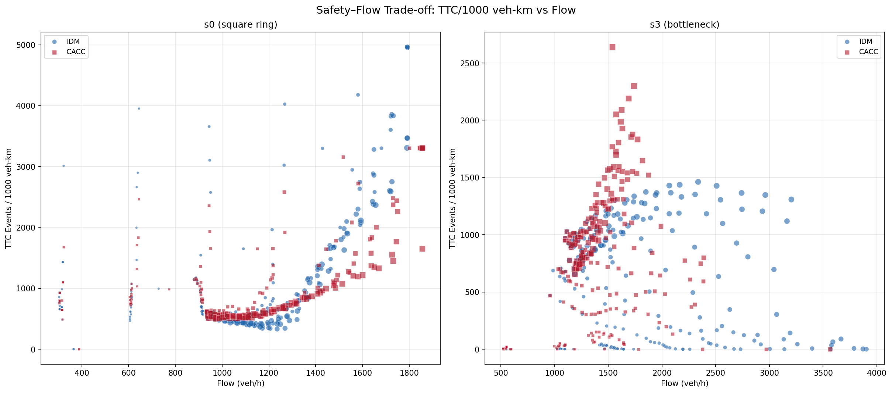
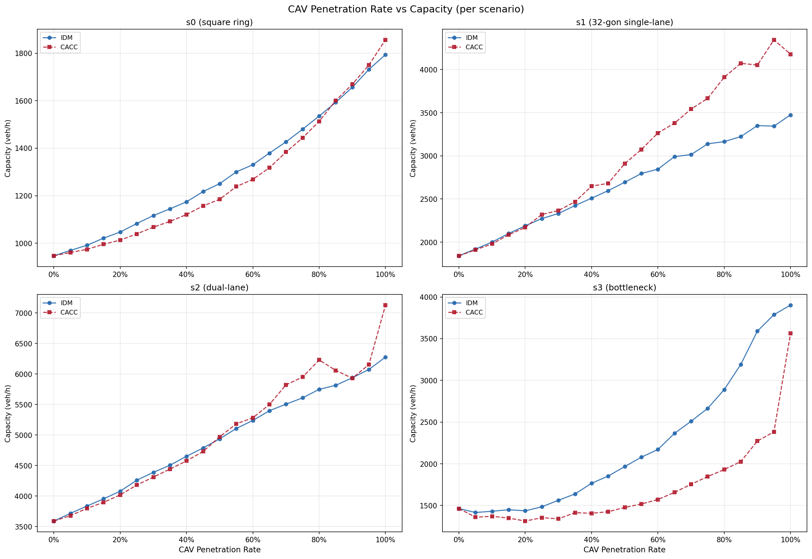
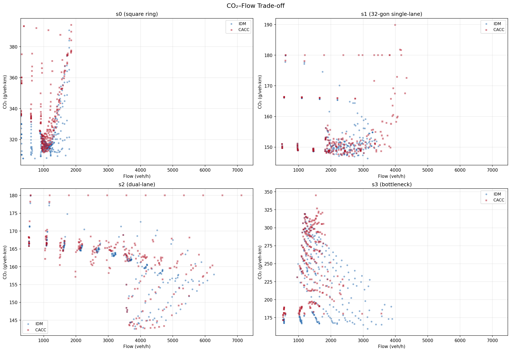
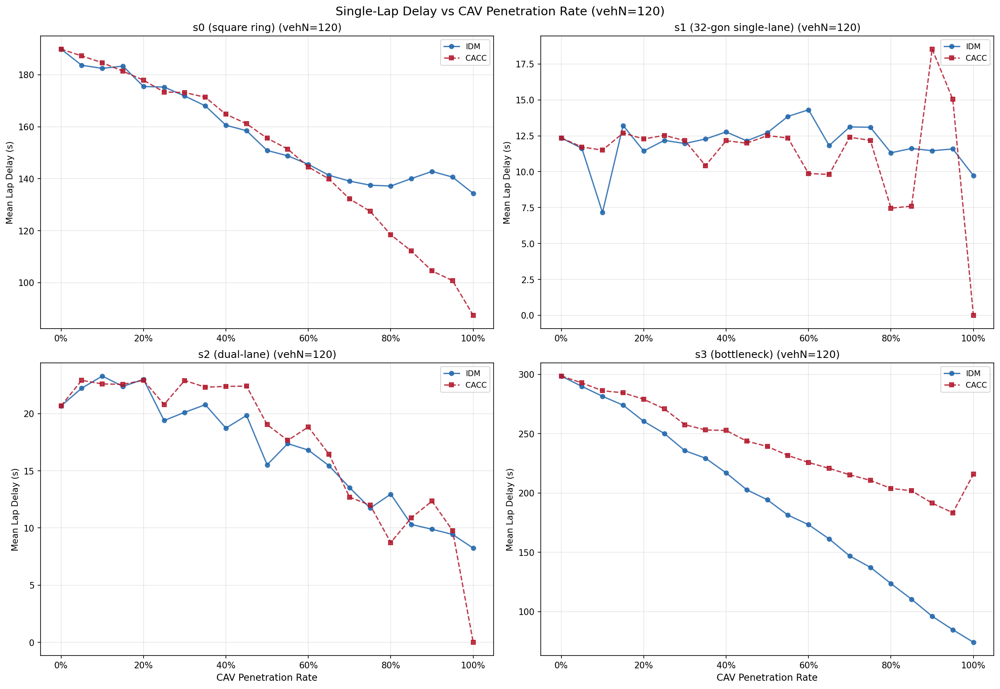

# CAV Multi-level Penetration Simulation

> A reproducible SUMO experiment platform for evaluating how CAV penetration and car-following control affect **observed flow, safety, emissions, and reference-relative lap time** under different road constraints.

`SUMO 1.27.1` · `Python 3.10+` · `10,080 + 3,888 + 84 simulations` · `v0.4.2`

[Key Findings](#key-findings) ·
[Scenario Design](#scenario-design) ·
[Core Results](#core-results) ·
[Quick Start](#quick-start) ·
[Experiment Report](docs/report.md) ·
[Engineering Audit](docs/engineering/audit.md) ·
[Migration](docs/engineering/migration.md) ·
[Release Checklist](docs/engineering/release-checklist.md)

---

## Research Question

> **Do the observed-flow gains of CAV car-following control come with safety, emission, or travel-time costs?**

The project compares **IDM** and **CACC** across four progressively constrained road structures. Rather than asking which model is universally better, it asks:

> **Which control strategy performs better under which road structure and traffic density?**

---

## Scenario Design

The four scenarios support three structured scenario comparisons:

- `s0 → s1`: geometry smoothing;
- `s1 → s2`: a transition to two lanes with added lateral freedom and lower per-lane density at fixed `vehN`;
- `s2 → s3`: introduction of a 125 m `2→1→2` merge bottleneck.


*From left to right, the scenarios progressively change geometry, lane count/lateral freedom, and merge constraints. These comparisons do not isolate a single causal factor.*

---

## v0.4.2 Formal-grid Results

v0.4.2 (jump release) ran a formal grid independent of the v0.4.0 historical
baseline: a 3,888-run main factorial (SSM disabled; 4 scenarios × 12 vehN ×
81 runs per (scenario, vehN) — cav=0: 3 + interior 4 levels × 2 models × 3
assignment seeds × 3 SUMO seeds: 72 + cav=vehN: 6 — with endpoint assignment
deactivation) and an 84-run safety experiment (4 scenarios × 3 vehN × 7 runs
per (scenario, vehN) — HV-only: 1 + 2 interior levels × 2 models: 4 + full-CAV:
2 — space-matched exposure, one seed pair per effective treatment key,
descriptive results only). Aggregates and summaries are tracked under
`results/v0.4.2/`; full per-run data is externally retained (see
[Data Availability](#data-availability)).

### Main factorial

Key v0.4.0 findings reproduce at the corresponding operating points:

- **s2, CACC, pCAV=1.0, vehN=120**: grid-observed maximum flow **7,128 veh/h**
  (IDM 6,276 veh/h, +13.6%);
- **s3, vehN=120, pCAV=1.0**: IDM **3,204 veh/h** / CACC 1,536 veh/h — the
  high-density merge-bottleneck reversal reproduces (IDM ≈ 2.1× CACC flow and
  a much smaller reference-relative lap time);
- scenario grid-observed peaks: s0 1,856.4, s1 4,178.4 (CACC, vehN=70),
  s2 7,128, s3 3,902.4 veh/h.

### Cross-version comparison

v0.4.2 reproduces key endpoints and some grid peaks exactly, but **that does
not mean all 528 shared treatment keys match the v0.4.0 grid numerically**.
Across the 528 shared keys: flow identical in 96, within 1% in 315, maximum
absolute difference ≈ 337.55 veh/h; delay median relative difference ≈ 6.04%;
CO₂ has no identical groups (the primary estimand is non-internal/non-internal
in both versions by design, but the acquisition pipeline, `withInternal`
handling and seed design differ, so no cross-version numeric-consistency or
change-rate inference is drawn). The s1 grid peak differs (v0.4.2: 4,178.4 @
CACC vehN=70 p=1.0 vs v0.4.0: 4,344.96 @ vehN=90 p=0.95) because the
penetration resolution was reduced from 21 to 6 levels. Emissions are
compared only within v0.4.2 (IDM vs CACC).

### Safety experiment

- main factorial and safety are **separate experiments**; no combined
  safety–flow trade-off is produced;
- **s1 and s2 show zero detected TTC events** — limited to the current
  `TTC < 3.0 s` threshold, SUMO 1.27.1, the safety grid and the configured SSM
  parameters; this is not a claim of "no conflict";
- every safety cell has **one seed pair only** — descriptive results, no
  significance inference;
- s1's sampling design differs from v0.4.0 (1 seed pair + subset grid vs
  5 assignment seeds × full grid), so no cross-version "no conflict"
  conclusion is drawn;
- SSM-on sampled peak RSS by scenario: s0 6.52 / s1 1.81 / s2 8.91 /
  s3 1.50 GiB (global peak 9,342,124 KiB @ s2_CACC_v120_c120) — historical
  observation context, not a hard budget;
- the subgroup table (HV/CAV) is a single-point (vehN=120, cav=96)
  descriptive summary and cannot decompose model-difference causes.

---

## Key Findings（v0.4.0 Historical Baseline）

### 1. CACC raises the observed peak flow in an unconstrained dual-lane network

In scenario **s2** at `pCAV = 1.0`, CACC reaches a maximum observed flow of **7,128 veh/h** within the tested vehicle-count grid, compared with **6,276 veh/h** for IDM—a **13.6% increase**. Both values occur at the upper grid boundary (`vehN = 120`), so they are not estimates of the true capacity peak.

Mean lap-time difference from the fixed scenario reference is close to zero for both models.

> This benefit is scenario-dependent and does not persist under the merge constraint in s3.

### 2. The advantage reverses at a high-density merge bottleneck

In scenario **s3** at `vehN = 120` and `pCAV = 1.0`:

| Model | Flow | Mean lap-time difference from reference | CO₂ intensity |
|---|---:|---:|---:|
| IDM | **3,204 veh/h** | **74.2 s** | 228.3 g/veh-km |
| CACC | 1,536 veh/h | 215.8 s | 352.0 g/veh-km |

At this fixed high-density operating point, IDM carries approximately **2.1 times** the flow of CACC while producing a much smaller reference-relative lap-time difference and lower CO₂ intensity.

> These values describe one fixed operating point. The maximum observed s3 flows within the tested grid are 3,902 veh/h for IDM and 3,564 veh/h for CACC.

### 3. TTC conflicts concentrate around geometric and topological constraints

Under the current `TTC < 3.0 s` SSM configuration:

- s0 contains frequent conflicts associated with periodic sharp-turn braking;
- s1 contains relatively few conflicts;
- s2 contains no detected TTC conflicts within the tested parameter grid;
- s3 contains dense conflict activity around forced merging.

The observed distribution is consistent with road geometry and loss of lateral freedom being major contributors to conflict formation.

> This interpretation is limited to the current SSM threshold, model parameters, and experiment grid. v0.4.1 delivered trajectory-level validation tooling and threshold sensitivity analysis; v0.4.2 ran a redesigned safety experiment (84 runs, space-matched exposure) independent of the main factorial grid.

---

## Core Trade-off（v0.4.0 Historical Baseline）



*CACC achieves high throughput in smooth, unconstrained networks, but the same advantage does not transfer directly to a dense merge bottleneck.*

---

## Why This Matters

Earlier versions of the project primarily evaluated CAV performance through **traffic capacity**. Capacity alone, however, cannot determine whether a traffic state is also safe, energy-efficient, or time-efficient.

v0.4.0 therefore extends the evaluation framework to four dimensions:

| Dimension | Primary metric | Supporting metrics |
|---|---|---|
| Flow performance | Traffic flow and maximum observed flow within the tested grid | Mean speed and temporal speed variance |
| Safety | TTC conflicts per 1,000 non-internal-edge veh-km | Minimum TTC, DRAC, emergency braking and lane-change gaps |
| Emissions | CO₂ g/non-internal-edge veh-km | NOx, PMx and fuel consumption |
| Efficiency | Mean lap-time difference from fixed reference | P95 reference difference, lap-time variation and time loss |

All safety and emission intensity metrics use `total_vehicle_km` from edgeData over `[600, 3600)`. The historical additional file used SUMO's default `withInternal="false"`: the denominator excludes junction internal edges, while SSM events are not restricted to the same edge subset. Consequently, normalized safety values are **whole-network events divided by non-internal-edge exposure**, not fully space-matched event rates. Emission numerator and denominator are mutually matched but both represent non-internal edges.

The results indicate that **no single car-following model is globally optimal across road structures**. CACC performs strongly in smooth and unconstrained environments, while its high-throughput regime can deteriorate under forced merging.

---

## Core Results（v0.4.0 Historical Baseline）

All plots are generated from data aggregated across five vehicle-type assignment seeds. Means and arrangement variability are retained in `aggregated_results.csv`.

Detector `mean_speed_m_s` is the arithmetic mean of non-empty 120-second
detector-window speeds; `detector_mean_speed_temporal_variance` is the
population variance across those windows. These are window-level temporal
descriptors, not vehicle-weighted mean speed. A frozen-raw audit found no empty
post-warmup detector windows in the 10,080 formal runs.

### Maximum Observed Flow Within the Tested Grid

CACC has higher observed maxima in s1 and s2 under high CAV penetration. The largest value in the tested grid, **7,128 veh/h**, occurs in s2 with CACC at `pCAV = 1.0` and the upper boundary `vehN = 120`.

The s3 bottleneck reduces the grid-observed maximum flow by approximately 45–50% relative to s2, and IDM performs better than CACC at the highest tested density.



### Safety–Flow Trade-off

The main safety metric is:

```text
whole-network TTC conflict events / 1,000 non-internal-edge vehicle-km
```

This exposure-normalized value is used alongside raw TTC totals because travelled distance differs across traffic states. It is internally time-matched but not fully space-matched; it should not be treated as an unbiased cross-scenario full-network event rate.

The principal trade-off is shown in the overview figure above:

- s0 conflicts are associated with periodic braking at 90° corners;
- s3 conflicts concentrate around the merge bottleneck;
- s1 contains few conflicts;
- s2 contains no detected conflicts under the current configuration.

### CO₂–Flow Trade-off

In unconstrained scenarios, differences between IDM and CACC are relatively small and are largely associated with traffic density.

Under the high-density s3 bottleneck, CACC's flow reduction, larger reference-relative lap time, and CO₂ deterioration occur simultaneously.



### Lap-Time Difference From the Fixed Reference

Scenarios s1 and s2 remain close to the fixed scenario reference under most tested conditions. The reference-relative difference in s0 increases through repeated braking at the four sharp corners.

Scenario s3 produces the largest reference-relative differences. At `pCAV = 1.0` and `vehN = 120`, the mean CACC difference reaches **215.8 s**, compared with **74.2 s** for IDM.



### Scenario-Dependent Summary

| Scenario | CACC relative to IDM | Primary interpretation |
|---|---|---|
| s0 — sharp geometry | Small observed-flow gain; conflicts persist | Sharp corners repeatedly disturb longitudinal flow |
| s1 — smooth single lane | Clear observed-flow advantage; few conflicts | Smooth geometry supports stable dense following |
| s2 — smooth dual lane | **Largest grid-observed flow advantage**; no detected TTC | Dual lanes reduce longitudinal constraints and permit lane-changing |
| s3 — merge bottleneck | **Advantage reverses** at high density | Forced merging disrupts the high-throughput regime observed in s2 |

> **Main result:** under the current experimental configuration, CACC has a grid-observed flow advantage in smooth, unconstrained networks, but that advantage can diminish or reverse under a dense merge bottleneck.

This is an experimental observation rather than a claim that either model is universally superior. Full causal verification requires vehicle-level trajectory analysis.

---

## Experiment Design（v0.4.0 Baseline）

```text
4 scenarios
× 2 car-following models
× 21 CAV penetration levels
× 12 vehicle-count levels
× 5 vehicle-type assignment seeds
= 10,080 SUMO simulations
```

| Parameter | Value |
|---|---|
| Scenarios | s0, s1, s2, s3 |
| CAV models | IDM, CACC |
| CAV penetration | 0.00–1.00 in increments of 0.05 |
| Vehicle count | 10–120 in increments of 10 |
| Vehicle-type assignment seeds | 1–5 |
| Simulation duration | 3,600 s |
| Warm-up period | 600 s |
| Simulation step | 0.1 s |
| Detector period | 120 s |
| SSM TTC threshold | 3.0 s |
| SSM DRAC threshold | 3.0 m/s² |
| Emission class | HBEFA3/PC_G_EU4 for both HV and CAV |

`--seed` only shuffles the Python-generated CAV/HV type assignment across fixed
initial positions. It is not a SUMO random seed; the pipeline does not pass
`--seed` or `--random` to SUMO. Run metadata records this scope as
`seed_scope="vehicle_type_assignment"`. The five seeds are therefore five
vehicle-type arrangements, not five independent SUMO stochastic replications.
At `pCAV=0` or `pCAV=1`, changing this seed does not change the vehicle-type
arrangement.

Aggregation gives each successful assignment-seed run equal weight: ratios
such as TTC events per vehicle-km are calculated within each run and then
summarized using their arithmetic mean and standard deviation. They are not
pooled ratios formed by dividing events summed across seeds by exposure summed
across seeds. The output therefore describes arrangement sensitivity rather
than sampling uncertainty.

The formal experiment grid is defined in
[`configs/v0.4.0.json`](configs/v0.4.0.json). Batch runs load this versioned
configuration by default:

```bash
python3 -m scripts.simulation.batch_run \
  --config configs/v0.4.0.json \
  --dry-run
```

CLI grid options are explicit overrides. The resolved configuration and its
stable SHA-256 are written to `manifest.json`, so an overridden run remains
auditable. Invalid penetration levels, duplicate/empty lists, inconsistent
network mappings, non-positive frequencies, and `warmup >= simulation_end` are
rejected before any run directory is created. The warmup boundary must also be
an exact multiple of both the detector and edgeData frequencies, because their
parsers retain complete intervals rather than partial intervals.

Audit the formal grid without running SUMO:

```bash
python3 -m scripts.experiment_audit --config configs/v0.4.0.json
```

The frozen v0.4.0 audit reports 2,400 requested/realized penetration
mismatches, 400 duplicate penetration treatments, and 768 endpoint runs that
add no new vehicle-type assignment information. Use `--json` for a
machine-readable report.

Each prepared run contains `run_spec.json` with the complete simulation
parameters and derived penetration metadata (`requested_pcav`, `cav_count`,
`hv_count`, and `realized_pcav`). `simulation_status.json` references its
SHA-256; the parser refuses a missing or modified RunSpec instead of rebuilding
parameters from the run directory name.

For small vehicle populations, `realized_pcav` can differ from
`requested_pcav` because the CAV count follows Python's existing
`round(vehicle_count * requested_pcav)` rule. The legacy CSV `pCAV` field
continues to mean the requested value for v0.4.0 compatibility. post3 also
emits self-describing `requested_pcav`, `realized_pcav`, `cav_count`, and
`hv_count` columns.

This is a known defect in the completed v0.4.0 experiment design, not merely a
display-rounding issue. At `vehN=10`, the 21 requested penetration levels map
to only 11 realizable vehicle compositions. For example, requested
`pCAV=0.15`, `0.20`, and `0.25` all produce 2 CAVs and 8 HVs, hence a realized
penetration of `0.20`. Across the formal grid, 2,400 runs have
`realized_pcav != requested_pcav`; 400 runs at `vehN=10` are duplicate
penetration treatments for the same scenario, model, and assignment seed.

The main reported operating points are unaffected because they use
`vehN=60`, `80`, or `120`, where every 0.05 penetration step is exactly
realizable. The defect primarily limits interpretation of low-density
penetration-response curves, especially `vehN=10`. Historical v0.4.0 results
must retain requested `pCAV` for compatibility and must not be relabelled as
realized penetration.

The release, experiment, pipeline and schema versions intentionally describe
different compatibility boundaries:

| Version axis | Value | Meaning |
|---|---|---|
| Release/package | `v0.4.0.post3` (public); v0.4.1 toolchain = internal milestone, ships with v0.4.2 | Measurement toolchain (subgroup, THW, sensitivity, free-flow) |
| Experiment config | `v0.4.0` | Published 10,080-run experimental design |
| Simulation pipeline | `v0.4.0.post1` | Frozen raw simulation provenance |
| Analysis | `v0.4.0.post3` | Warmup-aligned edgeData and SSM extreme-time reanalysis |
| Frozen pipeline schema | `1` | Schema recorded by the original simulation/parser pipeline |
| Post3 output schema | `v0.4.0.post3.1` | Schema 1 metrics plus explicit semantic alias/count columns |

Post3 does not rerun SUMO. Historical metadata correctly retains
`pipeline_version="v0.4.0.post1"` while the reanalysis manifest records
`analysis_version="v0.4.0.post3"`.

Post3 preserves experimental inputs and raw observations but corrects derived
metrics whose numerator and denominator previously covered different time
windows. Edge performance, emissions and SSM safety measures are re-derived for
the common `[600, 3600)` analysis window; affected aggregate values, figures and
interpretations therefore supersede post2.

The experiment-level `manifest.json` is created before SUMO starts. It records
the full planned grid, Git state, Python/SUMO/netconvert versions, platform,
launch command, resolved configuration hash, and SHA-256 values for every
network and `net.json`. Interrupted runs therefore remain distinguishable from
tasks that were never started.

Simulation, parsing, and writing form a verified metadata chain. Resume checks
the RunSpec, configuration, network, experiment and summary hashes; changing a
summary or input prevents a stale result from being silently reused. The parser
reads the pipeline version from `manifest.json` by default.

The 120-second detector period covers approximately two free-flow laps in the smooth scenarios and avoids the sampling resonance previously observed with a 60-second period.

Full configuration details, vehicle parameters, result tables, discussion and references are available in the [Experiment Report](docs/report.md).

---

## Metric Methodology

### v0.4.2 measurement scope

The v0.4.2 grid uses `withInternal="true"` edgeData, so the safety event
numerator and the vehicle-kilometre denominator share the same spatial scope
(whole network including junction internal edges). Emissions are accumulated
under two paired scopes: the primary intensity is non-internal-edge
CO₂ g / non-internal-edge veh-km (the same estimand definition as v0.4.0, so
the two versions are intended to be comparable at the definition level), and
a secondary whole-network intensity is reported alongside (`whole_network_*`
columns in the run-level and aggregated CSVs). Because the acquisition
pipeline, `withInternal` handling and seed design differ, the v0.4.0 and
v0.4.2 grids are **not numerically interchangeable**: no cross-version
numeric-consistency or change-rate inference is drawn between them.

### Why use SUMO SSM for TTC?

SUMO already knows the road topology, lane relationships and conflict participants. Using SSM avoids reconstructing leader–follower relationships from global Cartesian coordinates on curved and merging roads.

### Why normalize by vehicle-kilometres?

Different vehicle counts and congestion states produce different total travelled distances. Raw event or emission totals are therefore not directly comparable.

```text
TTC event rate
= whole-network TTC conflict count
  / non-internal-edge vehicle-km × 1,000
```

This is the historical post3 normalization label, not a fully space-matched
full-network risk rate.

```text
CO₂ intensity
= non-internal-edge CO₂ / non-internal-edge vehicle-km
```

### Why use `vehroute exitTimes` for lap time?

In a closed-loop network, unfinished trip duration represents the time a vehicle exists in the simulation, not the duration of one completed lap.

Lap times are reconstructed from successive route-edge exit times.

### Why distinguish `0` and `NaN`?

```text
0   = the source was parsed successfully and no event occurred
NaN = the source was missing, invalid, inapplicable or could not be parsed
```

Detailed definitions are documented in the source (see `scripts/schema.py` for field definitions and `scripts/parsing/runner.py` for invariant validation).

---

## Reproducible Pipeline

```text
10,080 RunSpec
        │
        ▼
6-worker parallel SUMO
        │
        ▼
independent run directories
        │
        ▼
serial seven-parser pipeline
        │
        ▼
summary.json × 10,080
        │
        ▼
single result writer
        │
        ▼
run_level_results.csv
        │
        ▼
five-seed aggregation
        │
        ▼
aggregated_results.csv
        │
        ▼
publication figures
```

| Stage | Main function | Wall time |
|---|---|---:|
| Parallel simulation | Six concurrent SUMO processes | ~17 h |
| Serial parsing | Seven parsers and invariant validation | 13.5 min |
| Result writer | 10,080 summaries → run-level CSV | ~2 s |
| Five-seed aggregation | 10,080 rows → 2,016 groups | ~1 s |

The simulation scheduler provides:

- deterministic `run_id` generation;
- isolated output directories;
- resume support;
- atomic status files;
- timeout and cancellation handling;
- heavy-task-first scheduling.

The parser pipeline provides:

- serial low-memory XML parsing;
- atomic `summary.json` and `parse_status.json`;
- resume support;
- explicit parser failure semantics;
- seven cross-metric invariant checks.

---

## Data Quality

```text
10,080 / 10,080  simulations completed
2,016 / 2,016    aggregated groups with n_valid = 5
212 / 212          automated tests passed
0                duplicate run IDs
0                parser failures
0                invariant violations
```

The testing strategy contains three levels:

1. parser fixture unit tests;
2. short SUMO smoke and positive-event tests;
3. representative multi-scenario integration tests and full-grid closure checks.

During the original batch, 74 runs failed because of memory pressure. They were rerun with one concurrent SUMO process and all were recovered before aggregation.

---

## Quick Start

### Requirements

```bash
sumo --version
python3 --version
```

Recommended versions:

```text
SUMO >= 1.27.1
Python >= 3.10
```

Create an isolated environment and install the locked development dependencies:

```bash
python3 -m venv .venv
source .venv/bin/activate
python -m pip install -r requirements-lock.txt
python -m pip install --no-deps -e .
```

SUMO remains a system dependency and is not part of the Python lock file.

Compile the four ignored/generated SUMO network files from the tracked
node/edge sources before running a simulation:

```bash
python3 -m scripts.simulation.network_generator --build-all
```

With SUMO/netconvert 1.27.1, this reproduces the network XML used by the
v0.4.0 experiment apart from generation metadata such as timestamp and output
path. Scenario 3 is built from its tracked bottleneck-specific edge source; it
is not reconstructed from an undocumented manual edit.

### Run the quality gates

```bash
pytest -q
ruff check .
ruff format --check .
mypy scripts/run_spec.py scripts/experiment_config.py scripts/provenance.py
python -m compileall -q scripts tests
```

Expected result:

```text
478 passed
```

### Run one simulation

```bash
python3 -m scripts.simulation.single_run \
  --vehN 60 \
  --pCAV 0.5 \
  --model IDM \
  --net net/scenario_2/loop.net.xml
```

### Regenerate the v0.4.0 figures

```bash
python3 -m scripts.results.visualization \
  --aggregated results/aggregated_results.csv \
  --v4
```

### Regenerate the v0.4.2 figures

Two separate commands (option spelling is case-sensitive `--outDir`); output
directories are written to `/tmp` by default below so the Git-tracked figures
under `graph/v0.4.2/` are not overwritten:

```bash
# main-factorial figures (capacity / CO2-flow / delay)
python3 -m scripts.results.visualization \
  --aggregated results/v0.4.2/main/aggregated_results.csv \
  --v4-2 --outDir /tmp/v042-figs/main

# safety figures (TTC + DRAC events by penetration, faceted by scenario × vehN)
python3 -m scripts.results.visualization \
  --aggregated results/v0.4.2/safety/aggregated_results.csv \
  --safety --outDir /tmp/v042-figs/safety
```

<details>
<summary><strong>Full 10,080-run reproduction workflow</strong></summary>

```bash
# Stage 1: parallel SUMO simulation
python3 -m scripts.simulation.batch_run \
  --config configs/v0.4.0.json \
  --sumo-processes 6 \
  --resume \
  --output-root /path/to/raw

# Stage 2: serial parsing
python3 -m scripts.parsing.batch \
  --input-root /path/to/raw \
  --resume

# Stage 3: single result writer
python3 -m scripts.results.writer \
  --input-root /path/to/raw \
  --output-dir /path/to/results \
  --manifest /path/to/raw/manifest.json

# Aggregate across seeds (mean / std / median / min / max)
python3 -m scripts.results.aggregate \
  --input /path/to/results/run_level_results.csv \
  --output /path/to/results/aggregated_results.csv \
  --schema-version 1

# Generate the four trade-off figures
python3 -m scripts.results.visualization \
  --aggregated /path/to/results/aggregated_results.csv \
  --v4
```

</details>

To reproduce the post3 corrected analysis without rerunning SUMO:

```bash
python3 -m scripts.results.reanalyze_post3 \
  --raw-root /path/to/raw \
  --source-run-level /path/to/post2/run_level_results.csv \
  --output-dir /path/to/post3-results
```

This leaves raw XML and post2 outputs untouched. It recomputes the affected
run-level metrics for the common warmup-adjusted window, aggregates them, and
writes a SHA-256 reanalysis manifest.

**Hardware guidance for `--sumo-processes`.** SUMO processes are CPU-bound and memory-hungry—each loads the network independently and writes raw XML output. RAM is the binding constraint; s3 at vehN=120 is the worst case per process. Before launching a full grid, check your machine:

| Resource | Rule of thumb | Check |
|---|---|---|
| RAM | Budget **2 GB per SUMO process** for headroom (s3 vehN=120 can spike); total SUMO memory must fit within *available* RAM | `free -h` (look at the `available` column) |
| CPU | `--sumo-processes ≤ nproc − 2` (reserve at least two logical cores for the OS and the Python parent) | `nproc` |
| Disk | ~6 GB per 1,000 runs with the default compact SSM output (`--device.ssm.trajectories=false`); the v0.4.0 experiment previously produced 423 GB in total (~42 GB per 1,000 runs) when full SSM trajectories were explicitly enabled | `df -h <output-root>` |
| I/O | Run directories are independent (no file conflicts), but a spinning disk may bottleneck at high concurrency | SSD strongly recommended |

**Pick your concurrency from available RAM** (CPU is rarely the bottleneck first):

| Available RAM | Safe `--sumo-processes` | Example machine |
|---|---|---|
| 8 GB | 1–2 | lightweight laptop |
| 12–16 GB | 2–4 | typical dev laptop / small desktop |
| 24–32 GB | 4–8 | workstation |
| 48+ GB | 8–12 | server |

Always run with `--resume` from the first launch—it costs nothing on a clean start and lets you recover from OOM kills or power loss without repeating completed work. If SUMO processes exit with non-zero codes at high vehicle counts (typically s3 vehN ≥ 100), cut `--sumo-processes` in half and resume; the offending runs will be re-attempted with less memory pressure.

---

## Data Availability

The repository includes:

- `results/aggregated_results.csv`  
  2,016 scenario–model–penetration–vehicle-count groups aggregated across five vehicle-type assignment seeds;

- `results/reanalysis_manifest.json` and `results/raw_input_inventory.jsonl`,
  which bind the source release, 30,240 raw input file identities and published
  aggregate hash;

- experiment configuration and plotting scripts;

- the four v0.4.0 result figures under `graph/v0.4.0/`;

- parser fixtures and unit tests.

All published figures can be regenerated from `aggregated_results.csv`.
The public repository can verify the aggregate file and raw-inventory digest,
but it cannot independently reproduce the reanalysis without obtaining the
separately retained raw XML and source run-level CSV. The manifest's run-level
hash identifies that external intermediate; it is not a claim that the file is
stored in Git.

The following files are not included because of storage size:

- raw SUMO XML outputs;
- per-run `summary.json` files;
- the full run-level dataset, which is retained in the external post3 archive.

After SSM compaction, the retained raw experiment directory is approximately 58 GB. The complete dataset can be regenerated through the pipeline above.

### v0.4.2 formal grid (jump release)

The repository includes:

- `results/v0.4.2/main/aggregated_results.csv` and `results/v0.4.2/safety/aggregated_results.csv`
  — 528 main-factorial groups (3,888 runs) and 84 safety groups, aggregated across
  the `(assignment_seed, sumo_seed)` combination unit (3 × 3 for main interior cells);
- `results/v0.4.2/result_handover.json` — minimal provenance handover: simulation
  (`a8aa09a`), parsing artifacts (`d963502` + post-generation validation `507a80d`),
  writer (`8f9ef4b` + schema-only rerun `e99cd89`), aggregate (`91c256f`) commits,
  main/safety manifest SHA, and the SHA-256 of the fifteen archived result paths;
- `results/v0.4.2/result_analysis.md` — structured results summary (peaks, s3 bottleneck
  reversal, Safety by vehN facet, cross-version comparison boundary, subgroup table);
- the v0.4.2 figures under `graph/v0.4.2/` (main factorial × 3 + Safety × 2: TTC and DRAC
  events-by-penetration, space-matched per-veh-km rates).

The following are **not** stored in Git (retained locally/externally, consistent with
the v0.4.0 post3 archive practice):

- `raw_v0.4.2/` — raw SUMO outputs, per-run `summary.json` / `simulation_status.json`
  (main ≈ 34 GB, safety ≈ 0.8 GB);
- `results/v0.4.2/{main,safety}/run_level_results.csv`,
  `run_level_subgroup_results.csv`, `writer_report.json`, `failed_runs.csv`
  (≈ 53 MB in total).

**Git-side integrity anchor for the external raw:** `results/v0.4.2/raw_status_inventory.jsonl`
(≈ 8.4 MB, Git-tracked) fixes the SHA-256 of every `simulation_status.json` and
`parse_status.json` for all 3,972 runs (main 3,888 + safety 84), sorted by
`experiment_role, run_id`, and expands the status-embedded SHA for route/type-map/
additional/network/net.json/raw-output/summary/subgroup. Its own SHA is recorded in
`result_handover.json`. Verification: check the inventory SHA against the handover
entry, then re-hash the status files under an external raw copy against the inventory
per-line entries.

The public repository can verify the aggregated CSVs, the handover SHA list, the raw
status inventory anchor and the figures; it cannot independently reproduce the v0.4.2
grid without the separately retained raw data. The handover/inventory SHA values
identify that external intermediate; they are not a claim that those files are stored
in Git.

---

## Repository Structure

```text
scripts/
├── config.py
├── run_spec.py
├── schema.py
├── simulation/
│   ├── single_run.py
│   ├── batch_run.py
│   ├── flow_generator.py
│   └── network_generator.py
├── parsing/
│   ├── runner.py
│   ├── batch.py
│   ├── detector.py
│   ├── stderr.py
│   ├── ssm.py
│   ├── lanechange.py
│   ├── edge_performance.py
│   ├── edge_emissions.py
│   └── vehroute.py
└── results/
    ├── writer.py
    ├── aggregate.py
    └── visualization.py

tests/
├── fixtures/
├── test_ssm_parser.py
├── test_vehroute_parser.py
├── test_edge_performance_parser.py
├── test_edge_emissions_parser.py
└── run_tests.py

results/
└── aggregated_results.csv

graph/v0.4.0/
├── scenario_overview.png
├── chart_capacity.png
├── chart_safety_flow.png
├── chart_co2_flow.png
└── chart_delay.png

docs/
├── README.md
├── report.md
└── engineering/
    ├── audit.md
    ├── migration.md
    └── release-checklist.md
```

---

## Limitations

- The formal CSV `pCAV` column is the requested penetration. Integer vehicle
  counts cause requested and realized penetration to differ in 2,400 runs; at
  `vehN=10`, 21 requested levels collapse to 11 actual compositions.
- Legacy result columns remain for compatibility, but post3 adds explicit
  requested/realized penetration, ordinary-edge exposure and whole-network
  TTC/ordinary-edge exposure aliases. Prefer the explicit names in new
  analysis.
- The five seeds are vehicle-type assignment realizations rather than
  independent SUMO stochastic replications. Endpoint penetrations do not gain
  distinct arrangements from additional seeds, so endpoint `n_valid=5` does
  not represent five independent observations.
- Across-seed means and standard deviations are equal-weight descriptive
  summaries of assignment runs, not pooled exposure ratios, confidence
  intervals or significance tests.
- The v0.4.0 results are not separated into HV and CAV sub-populations; v0.4.1 adds subgroup tooling (detector/edgeData/SSM/vehroute/lanechange/stderr + `parsing/metrics.py`), and the v0.4.2 formal grid provides HV/CAV subgroup results (run-level subgroup long table + aggregated subgroup metrics).
- The absence of detected TTC conflicts in s2 applies only to the current `TTC < 3.0 s` threshold and tested parameter grid.
- ACC is supported by earlier project versions but is not part of the formal v0.4.0 comparison.
- TTC events have not yet been independently reproduced from FCD or TraCI trajectories; v0.4.1 provides the trajectory-validation tooling (FCD physical THW), and the v0.4.2 safety experiment (84 runs) provides SSM-based event rates, but independent FCD/TraCI reproduction is still outstanding.
- SSM mirror deduplication is an analysis heuristic: opposite-direction records
  for the same vehicle pair are matched one-to-one when their encounter
  intervals overlap by at least 80% of the shorter duration. SUMO provides no
  shared event ID for deterministic pairing, so dense consecutive encounters
  may still be over- or under-deduplicated; absolute event counts should not be
  interpreted as exact physical conflict totals.
- v0.4.1 adds model-specific free-flow references (HV/IDM/CACC) as validated artifacts (D-008); the v0.4.0 baseline table itself remains as published.
- Automated tests cover parsers, experiment configuration, RunSpec integrity,
  provenance, simulation state transitions, resume validation, result writing,
  aggregation, network metadata and representative SUMO pipelines. Regular CI
  does not rerun the complete 10,080-run experiment.

---

## Roadmap

| Version | Focus |
|---|---|
| v0.4.0.post3 | Unified observation-window reanalysis of the frozen 10,080-run grid (public baseline) |
| v0.4.1 | Measurement and experimental-design upgrade: HV/CAV subgroup metrics, physical THW, compact FCD/TraCI validation, TTC threshold sensitivity, space-matched exposure, independent SUMO/assignment seeds, model-specific free-flow references, and a bounded pilot (internal milestone, **not released**; engineering outcomes folded into v0.4.2) |
| v0.4.2 | Formal grid (jump release): main factorial 3,888 runs (efficiency/emissions/FCD, SSM disabled) + independent safety experiment 84 runs |
| v0.5.0 | Real-trajectory-driven car-following model calibration and simulation validation |
| v0.6.0 | TraCI-based dynamic traffic control |
| v0.7.0 | CACC communication degradation, including packet loss and latency |

v0.4.1 delivered the measurement toolchain; its micro-pilot Level 1 (10 runs)
passed, and Level 2 bounded factorial pilot (162 runs) was completed but failed
the original resource gate (SSM memory exceeded 2 GiB at high density). The
v0.4.0 10,080-run grid was not re-run. v0.4.2 (jump release) ran the formal
grid: a 3,888-run main factorial with SSM disabled and an independent 84-run
safety experiment with space-matched exposure (see [Data Availability](#data-availability)).

---

## Documentation

| Document | Purpose |
|---|---|
| [Experiment Report](docs/report.md) | Complete experimental design, result tables, discussion and conclusions |
| [Documentation index](docs/README.md) | Experiment report, engineering audit, migration and release checklist |
| `scripts/` source | Inline docstrings; see § Repository Structure below for module map |

---

## Citation

When using this project, please cite the repository and release version:

```bibtex
@software{cav_multi_level_penetration_simulation_2026,
  author  = {Uriel62-chang},
  title   = {CAV Multi-level Penetration Simulation},
  version = {v0.4.2},
  year    = {2026},
  url     = {https://github.com/Uriel62-chang/CAV_Multi-level_Penetration_Simulation}
}
```

---

## License

This project is released under the [MIT License](LICENSE).
