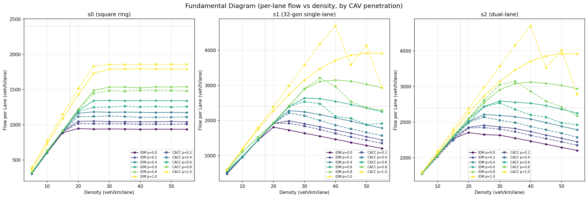
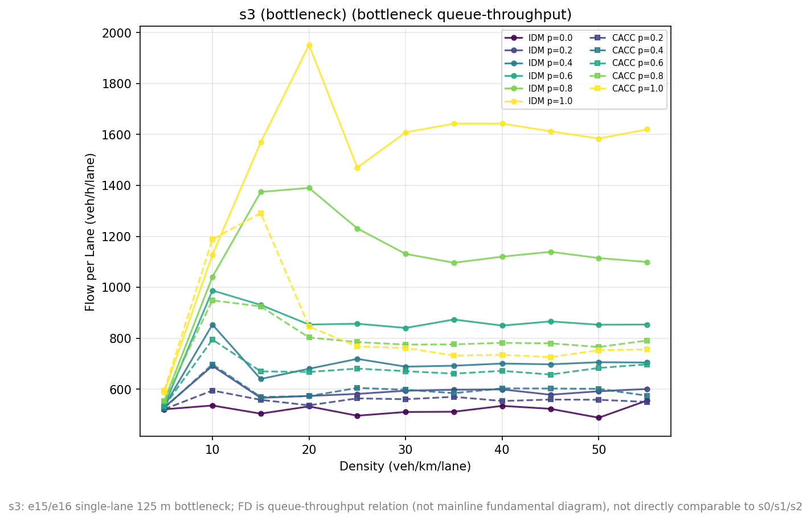
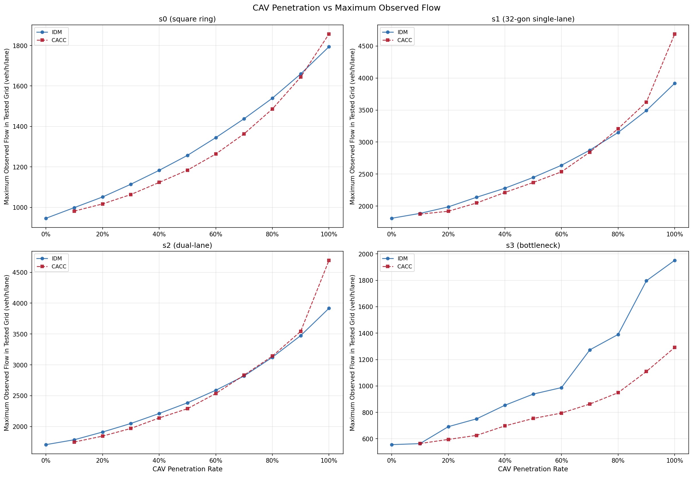
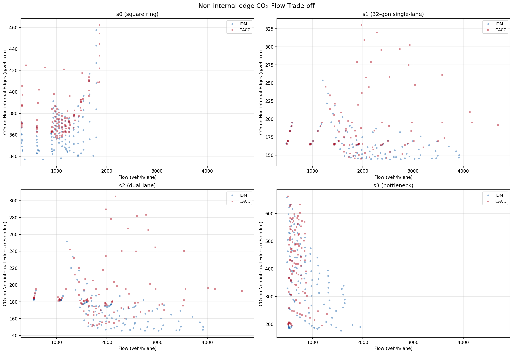
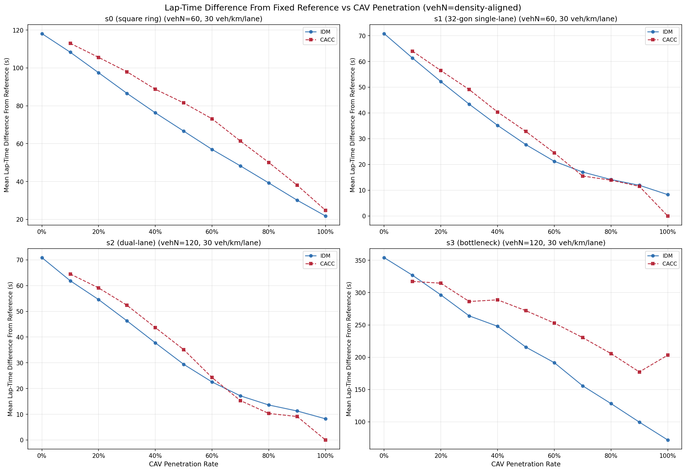
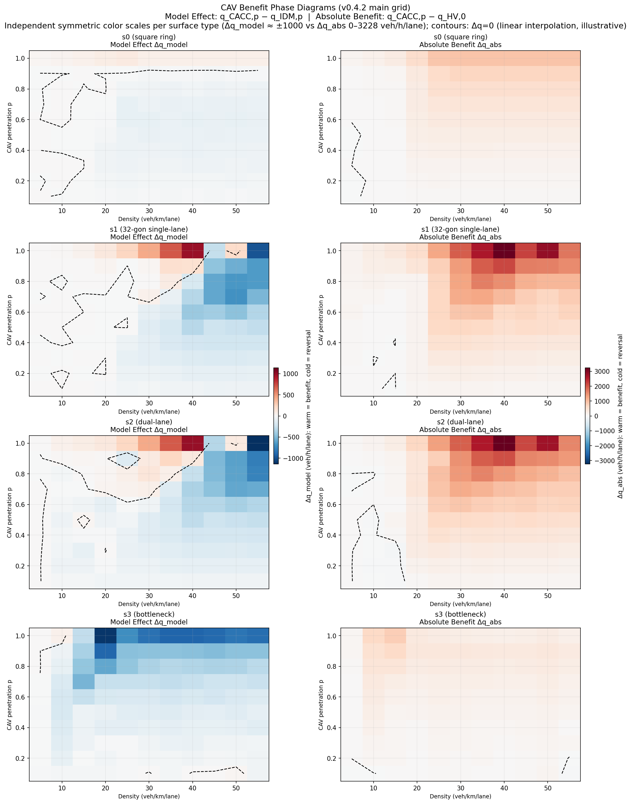

# v0.4.2 Formal Experiment Report: CAV Multi-level Penetration Simulation (U55 Fundamental-Diagram Design)

> **Project-name history**: this report was published with v0.4.2 under the former
> name *CAV Multi-level Penetration Simulation*. The project was renamed **CAV
> Mixed-Traffic Lab** after v0.4.2. To preserve release provenance, the report title,
> citation, experimental results and conclusions remain as published.

> **Version**: v0.4.2 (jump release; v0.4.1 was an internal milestone, **not released**, outcomes folded into this version)
> **Grid**: 7,524-run main factorial (SSM enabled for the full grid — merged design)
> **Simulation**: SUMO 1.27.1 · 3 workers / 21.86 h / 0 failures · observation window [600, 1800)
> **Data**: `results/v0.4.2/main/aggregated_results.csv` (924 groups × 329 columns); raw 76 GB kept in external backup
> **中文版**: `docs/report.cn.md`

---

## Abstract

On four progressively constrained road structures (s0 square single-lane → s1 smooth single-lane → s2 dual-lane → s3 merge bottleneck), this experiment systematically compares the IDM and CACC car-following controls across **flow, safety, emissions, and efficiency** on a 7,524-run main grid with a unified density axis 5–55 veh/km/lane, cav_count in 0.1 steps (11 levels) and 3×3 dual seeds. Main findings:

1. **The capacity fundamental diagram holds and the FD peak shifts with penetration**:
   HV peaks at k≈20 and CACC full-CAV at k≈40, consistent in direction with the
   theoretical critical densities (HV 17.4 / CAV 39.2 veh/km/lane); the IDM full-CAV
   high-density branch shows no falling edge inside the axis cap (55 = 37.5% of jam
   density) — k≈50 is the grid-observed maximum, not a measured capacity peak.
2. **s0 corner baseline**: the square 90° turns cap free-flow speed at ≈17.9 m/s; HV flow flattens at ≈940 veh/h/lane (k≥20), full-CAV peaks at 1,794 (IDM) / 1,857 (CACC) @ k40.
3. **s3 high-density merge-bottleneck reversal**: at k=55 full CAV, IDM sustains 1,620 veh/h/lane while CACC drops to 756 veh/h/lane — CACC throughput degrades under forced merging, with delay and emissions rising simultaneously.
4. **No globally optimal model**: CACC excels in smooth unconstrained environments and deteriorates at forced merges; safety events (TTC) concentrate at high densities (s1/s2 only at k≥35); s3 is the highest-risk scenario.

---

## 1. Background

Automated and connected vehicles (CAV) are expected to improve capacity and safety, but whether those gains come with safety, emission, or travel-time costs is a central open question. Earlier versions (v0.4.0, 10,080-run grid) primarily evaluated the capacity dimension. v0.4.2 extends the framework to four dimensions (flow / safety / emissions / efficiency) and, after the P0 insertion-defect fix (`departSpeed="0"`) and an empirically calibrated warmup (600 s), redesigns the main grid as a **fundamental-diagram scheme** (U55: free-flow →
critical → congested with limited high-density reach — axis cap 55 = 37.5% of jam
density, near-jam segment not covered).

v0.4.1 completed the measurement-chain upgrade (HV/CAV subgroups, FCD physical time headway, independent assignment/sumo dual seeds, SSM sensitivity tooling, etc.) as an internal milestone but did not pass the old resource gate and was not released; its engineering outcomes are folded into this version.

---

## 2. Experimental Design

### 2.1 Design rationale (user-confirmed, 2026-08)

1. **Density cap at near-jam density (not full blockage)** — to render the
   fundamental-diagram shape (mountain + right-skewed tail) without measuring the
   fully stalled regime.
2. **`departSpeed="0"`** — stationary insertion so a stable flow forms before
   warmup ends; the closed-loop network mirrors real high-grade roads.
3. **Warmup duration set jointly with ②** — determined by SUMO measurement
   (§2.3), not by formula.

### 2.2 Scenario chain

| Scenario | Geometry | Lanes | Ring | Design contrast |
|---|---|---|---|---|
| s0 | square, 90° turns | 1 | 2.0 km | corner-limited baseline (internal corner lane 3.9 m/s) |
| s1 | 32-gon smooth | 1 | 2.0 km | s0→s1 geometry smoothing |
| s2 | 32-gon smooth | 2 | 2.0 km | s1→s2 lane count / lateral freedom |
| s3 | 32-gon + single-lane 125 m bottleneck (e15/e16) | 2 | 2.0 km | s2→s3 forced merge |

### 2.3 Grid (U55)

- **Density axis**: unified 5–55 veh/km/lane (s0/s1 single-lane vehN 10–110 step 10; s2/s3 dual-lane vehN 20–220 step 20); the cap of 55 is set by the measured s2 SSM memory boundary (v220 probe 22.67 GiB).
- **Penetration**: cav_count 0.1 step, 11 levels (all integers; endpoint assignment deactivated by sentinel).
- **Seeds**: 3 × 3 dual seeds (assignment_seed × sumo_seed; interior n=9, endpoint n=3).
- **Simulation window**: warmup=600 s (9-cell measured calibration stable ≤120 s,
  see table below), simulation_end=1800 s, observation window [600, 1800).

**Warmup calibration (2026-08, 9 cells measured under `departSpeed="0"`, FCD 1 s)**:

| Cell | Density / composition | Steady-state mean speed | Stable by |
|---|---|---|---|
| s0 v20 | 10 veh/km/lane, HV free-flow | 16.1 m/s (14–18 spread) | ≤120 s |
| s2 v160 | 40, HV mid-density | 10.3 m/s (very stable) | ≤120 s |
| s2 v240 | 60, HV | 5.2 m/s | ≤120 s |
| s2 v240 c0.5 | 60, HV/CAV mixed | 8.9 m/s | ≤120 s |
| s2 v360 | 90, HV | 1.9 m/s | ≤120 s |
| s3 v240 | 60, HV bottleneck | 2.7 m/s (1.6–3.0 spread) | ≤120 s |
| s3 v360 | 90, HV bottleneck | 1.6 m/s (spread) | ≤120 s |
| s0/s1 v180 | 90, HV | 1.9 m/s | ≤120 s |

(All ≤120 s to steady state, 120 s sampling; warmup=600 s gives 5× headroom; the
"mid-density is slower" hypothesis was refuted — s2 v160 is the most stable;
CAV mixing stabilizes no slower than pure HV.)
- **Insertion**: `departSpeed="0"` (stationary insertion, cold start absorbed by warmup; fixes the P0 high-density insertion loss).
- **SSM enabled for the whole grid** (merged design): TTC=3.0 s, DRAC=3.0 m/s², range=50 m, greedy mirror dedup 80%, withInternal=true.
- **Total**: 4 scenarios × 11 vehN levels × 171 runs/treatment = **7,524 runs**.

### 2.4 Metric definitions

- **Flow/density**: detector-measured flow is authoritative; the FD x-axis uses the nominal density (vehN / lanes / 2 km) — a nominal-density × measured-point-flow pairing (see §8 limitation 1).
- **Safety**: whole-network TTC events / whole-network veh-km (withInternal=true space-matched); DRAC, emergency braking, lane-change gaps as supporting metrics.
- **Emissions**: primary intensity non-internal CO₂/veh-km (definition-level comparable to v0.4.0); whole-network intensity reported as secondary (`whole_network_*` columns).
- **Efficiency**: signed difference from a fixed reference lap time (reconstructed from vehroute); 0-vs-NaN contract (0 = parsed, no event; NaN = not applicable).

---

## 3. Pipeline Quality and Reproducibility

| Item | Value |
|---|---|
| Simulation | 7,524/7,524 SUCCESS; 3 workers / 21.86 h (SUMO cumulative 65.53 h, parallel efficiency 3.00); 0 failures (staggered scheduling) |
| Parsing | 0 INVALID (insertion-integrity guard: actual vehicles < vehN → INVALID_DATA; passed the full grid) |
| Writer | 0 exclusions |
| Aggregation | 924 groups (4 × 11 × 21; interior n=9 / endpoint n=3) |
| Tests | 492 passed (gate baseline: 451 + 38 analysis layer + 1 R13 zero-variance regression + 2 R16 regressions); ruff / mypy / compileall / format all green |
| Hardware | 32 GB host; WSL2 memory=24GB / processors=16 / swap=8GB; SUMO 1.27.1 |
| Resources | worst cell (s2 v220 full CAV) peak RSS 13.64 GiB; raw 76 GB (≈10.1 GB per 1,000 runs) |
| Data consistency | detector flow = lap-time-derived flow (deviation <0.5%); aggregate recompute 0 diff; HV+CAV additivity holds |

Formal input byte anchoring: `net/*/net.json` matches the formal run; `artifacts/free_flow/` is a parsing input dependency with versioned SHA gates.

**Design rationale (merged from EXPERIMENT_DESIGN; the original moves to
`docs/internal/` for local maintenance)**:

- **Memory constraint on the density cap (measured 2026-08)**: s2 full-CAV peaks
  v160=9.51 GiB, v200=22.69 / v220=22.67 GiB (both SUCCESS, at the 24 GB+swap
  edge), v230+ >22.7 GiB (OOM) — SSM per-vehicle-pair tracking overhead grows
  with density; hence the unified cap of 55 veh/km/lane (v220 dual-lane / v110
  single-lane), shrinking the FD right end from the former U90 68% of jam density
  to 37.5% (still covering the critical 17.4 and mid-congestion; "near-jam"
  semantics becomes "limited high-density reach", declared in the report).
- **3 workers decision**: fixed optimal concurrency under the memory constraint —
  event-driven simulation 3w 5.6% failures/24h vs 6w 50%/32h (2–3 concurrent
  saturate the s2 high-memory segment); measured 0 failures / 21.86 h.
- **Design decision log (2026-08)**: ① rationale near-jam density (non-blocked) +
  departSpeed=0 + measured warmup — user-confirmed; ② U90 (68% kj) selected then
  shrunk to U55 (37.5% kj) by memory measurement; ③ s3 on the same axis, charted
  separately with bottleneck semantics; ④ warmup=600 finalized; ⑤ main.json lands
  U55 (7,524 runs, config_version=v0.4.2-main-7-U55-v220cap).

---

## 4. Results

### 4.1 Flow and the fundamental diagram (FD)

Per-lane grid-observed peaks (veh/h/lane):

| Scenario | IDM peak | @vehN/k | CACC peak | @vehN/k |
|---|---|---|---|---|
| s0 | 1,794 | 80 / k40 | 1,857 | 80 / k40 |
| s1 | 3,918 | 100 / k50 | 4,689 | 80 / k40 |
| s2 | 3,916 (both lanes 7,833) | 200 / k50 | 4,694 (both lanes 9,387) | 160 / k40 |
| s3 | 1,952 (both lanes 3,903) | 80 / k20 | 1,292 (both lanes 2,583) | 60 / k15 |

- **FD peak shifts with penetration** (s1/s2): HV-only k≈20 → CACC p=1.0 k≈40,
  consistent in direction with the theoretical kc (17.4 / 39.2); CACC peaks higher
  and closer to its theoretical kc. **The IDM full-CAV high-density branch rises
  monotonically to k50 then plateaus (no falling edge inside the axis) — k≈50 is the
  grid-observed maximum, not a measured capacity peak (axis cap 55 = 37.5% kj,
  near-jam segment not covered)**.
- **s0 corner baseline**: HV-only flattens at ≈940 veh/h/lane (k≥20) — corner
  speed limit rather than the τ limit; full-CAV peaks 1,794 (IDM) / 1,857 (CACC) @ k40,
  both below the τ-limited 2,400.

- **s3 bottleneck semantics**: the FD is a bottleneck queue–throughput relation (not a
  mainline FD). s3 is a closed loop with no inflow/outflow, so flow is conserved
  across cross-sections — the single-lane bottleneck throughput equals the ring
  total. HV throughput is **≈1,000–1,150 veh/h** (measured 976–1,111; per-lane
  ≈520); **IDM full-CAV ≈3,200–3,900** (peak 3,903 @k20, k30–55 3,168–3,285,
  per-lane ≈1,950), **above the τ-limited 2,400**; CACC full-CAV drops to
  **≈1,500–2,600** (peak 2,583 @k15, k30–55 only ≈1,450–1,520, per-lane ≈1,290) —
  the **2→1 merge conflict** dominates.

### 4.2 Safety

- TTC-detected runs: s0 1,875/1,881 (≈100%), s1 161/1,881 (9%), s2 333/1,881 (18%),
  s3 1,807/1,881 (96%); s1/s2 detections concentrate at k≥35.
- At high densities CACC event rates exceed IDM (s2 CACC up to ≈2,475 vs IDM ≈2
  events/1,000 veh-km).
- Emergency braking concentrates in s3 (14,989 events, max 44/run).
- Note: event rates are space-matched (whole-network events / whole-network veh-km);
  mirror dedup is an analysis heuristic (one-to-one at 80% overlap) — absolute counts
  are not exact physical conflict totals.

### 4.3 Emissions

- CO₂ intensity (non-internal): s0 337–462, s1 144–330, s2 146–305, s3 176–661 g/veh-km.
- CACC exceeds IDM at high densities on s2/s3 (the emission cost of the bottleneck-reversal regime).

### 4.4 Efficiency

- At the k=30 operating point (density-aligned): s0 full-CAV ≈22–25 s reference lap
  difference, s1/s2 ≈0–8 s; s3 full-CAV IDM 72 s vs CACC 203 s.
- **s3 k≥40 efficiency numbers are selection-biased** (coverage k=40 93% / k=50 68% /
  k=55 75%): report quantitatively only up to k≤35; k≥40 is directional only
  (see §8 limitation 6).

---

## 5. Synthesis

- **FD shape and peak shift**: HV, CACC and mixed-penetration (p=0.5) show a
  complete right-skewed mountain (measured p=0.5 peak k30 2,447 → k55 1,991); **the
  IDM full-CAV high-density branch is truncated by the axis cap (55 = 37.5% kj) with
  no falling edge inside the axis**. Higher penetration moves the peak toward the
  theoretical kc and raises peak flow — CACC (smaller τ) extends the free-flow–critical branch.
- **s0 corner baseline**: corner speed limits cap capacity below the τ-limited 2,400 —
  HV-only plateau ≈940 veh/h/lane (k≥20), full-CAV peaks 1,794/1,857 @ k40 — a
  designed-in independent variable of the s0→s1 geometry smoothing contrast, not a
  defect; s0 emissions/TTC/delay are amplified by repeated corner
  acceleration–deceleration.
- **s3 bottleneck reversal**: under high-density forced merging, CACC throughput
  degrades (1,620→756 veh/h/lane) while delay (72→442 s) and emissions
  (339→633 g/veh-km) worsen — "high throughput is efficient" does not hold at merges.
- **No global optimum**: across the four dimensions no single model dominates; CACC
  advantage is scenario-dependent and its weakness concentrates at high-density merges.

### 5.1 Analysis layer: dual phase diagrams and threshold detection

> The analysis layer (`scripts/analysis/`, 7 modules) is part of v0.4.2; all results
> are computed from the shipped formal-grid aggregate
> `results/v0.4.2/main/aggregated_results.csv` alone (single data source, no
> additional simulation). The statistical stance follows §8:
> interior cells n=9; effect size + descriptive intervals + cross-seed consistency,
> **not formal significance testing**; p has a 0.1 step, so thresholds are reported
> as step intervals (e.g. `p* ∈ (0.5, 0.6]`).

**Dual phase diagrams (read side by side; no single baseline is forced)**:

- **Model Effect Surface** (Δq_model = q_CACC,p − q_IDM,p, same-penetration model contrast);
- **Absolute Benefit Surface** (Δq_abs = q_CACC,p − q_HV,0, absolute benefit over the pure-HV baseline).

Measured highlights (the Δq=0 contour is a linear interpolation between steps and
is illustrative only; step-level thresholds are in the p*/k* tables below):

- **s0/s1/s2 show no s3-style all-level reversal** (in the strict status sense: no
  reversal cells — s0: all 11 density levels gain/mixed; s1/s2: 5 gain + 4 mixed + 2
  no-crossing) — but **s1/s2 high-density k≥45 levels also lose at every penetration**
  (no-crossing: Δq_model negative throughout, same nature as the s3 reversal cells
  except the curve never crosses positive); cross-seed consistency of flow Δq_model
  is reversal-majority in every scenario (s0 58/41/11, s1 53/47/10, s2 50/51/9,
  reversal/mixed/gain, 110 cells/scenario); the equal-weight Δq_model mean is
  negative (s0 −26 / s1 −93 / s2 −99 veh/h/lane) — **higher peaks and weaker
  equal-weight means coexist**, supported by different estimands (grid maximum vs
  equal-weight mean).
- **s3 bottleneck reversal (core finding)**: high densities k∈{30,40,45,50} show
  **reversal** (`p* ≤ 0.1` with `p_reversal_start ∈ (0.1, 0.2]` — **any p≥0.2 mix
  inverts throughput at the forced-merge bottleneck**; the p=0.1 marginal cell has a
  slightly positive point estimate (+3.5…+25.3 veh/h/lane) but its interval crosses
  0, so no positive-benefit claim); k∈{15,20,25,35,55} never gain (`p* > 1.0`);
  only low densities k=5/10 gain at high penetration (`p* ∈ (0.7,0.8]` /
  `(0.9,1.0]`). **k\* reversal densities**: p=0.8/0.9 → k* ∈ (5,10], p=1.0 →
  (10,15], p=0.1 → (30,35]; p∈{0.2,…,0.7} never gain. Effect size corroborates:
  the s3 Δq_model Cohen's d median is **−2.74** with only 6.1% positive (large
  reversal; the 44 full-CAV deterministic cells with zero cross-seed variance have
  undefined d and are excluded and flagged — zero variance means the effect is
  fully determined, not negligible).
- **Pareto** (four dimensions: max flow / min delay / min conflict / min CO₂, no
  hand-picked weights; comparisons are within the same (scenario, density) group —
  density is an external demand parameter, not a design variable): all four fronts
  span the full penetration range [0, 1.0] and there is no single globally optimal
  penetration; **the s3 front is the smallest (60 points) and skews toward low- to
  mid-penetration and IDM configurations** — front pCAV mean 0.473 (lowest of the
  four), p≥0.6 share 33.3% (s0/s1/s2: 76.8%/59.3%/60.4%), IDM share 76.7% (highest):
  the high-penetration CACC flow/delay deficit at the bottleneck makes those points
  dominated within their density groups; s0/s1/s2 fronts carry higher high-p shares
  — different scenarios have different Pareto-optimal regions.
- **Sensitivity**: p* steps are unchanged in 109/132 cells under alternative
  estimands — breakdown: flow total vs per-lane 44/44 unchanged (lane count is
  constant within a scenario, so this pair is a scale-consistency check whose
  invariance is expected); delay mean vs p95 34/44 and TTC vs DRAC 31/44 are the
  discriminating contrasts — threshold conclusions are robust to estimand choice.

**Interim scientific conclusion**: the CACC performance reversal is not an artifact
of a few random seeds — the s3 high-density reversal reproduces consistently across
density levels and penetrations (cross-seed consistency + step intervals + effect
size), and shows a recognizable benefit boundary (p*/k* step intervals) driven by
bottleneck geometry, traffic density and CAV penetration.

---

## 6. Conclusion

1. The 7,524-run U55 main grid completed end-to-end (0 failures, 0 INVALID, 0
   exclusions, 924 groups) with self-consistent data (detector flow = lap-derived
   flow, HV+CAV additivity, aggregate recompute 0 diff).
2. The FD peak shifts with cav penetration (HV k=20 / CACC k=40; the IDM full-CAV
   high-density branch is truncated by the axis cap, k≈50 being the grid-observed
   maximum); the fundamental-diagram scheme meets its design intent (free-flow →
   critical → congested with limited high-density reach).
3. The s3 high-density merge-bottleneck reversal holds and is robustly supported by
   the flow metric; efficiency corroboration is used per density tier.
4. No P0/P1 code-logic defects remain (pipeline review converged after 18 rounds:
   code-layer convergence, data/document-layer closure, and release/artifact-state
   verification; all P1s/P2s fixed or documented closed, none open).

---

## 7. Future Work

(Synced with the internal Roadmap, 2026-08: v0.6.0 absorbs the former v0.7.0
communication-degradation work as phase D; v0.7.0 is demoted to a conditional reserve.)

- **v0.5.0**: real-trajectory-driven **HV** car-following calibration and validation —
  NGSIM/HighD highway-straight data calibrate HV car-following parameters; CAV
  (IDM/ACC/CACC) keeps literature/set values, forming an "HV empirical baseline vs
  CAV model-set" contrast; SUMO reproduction + generalization-boundary report.
- **v0.5.1**: **HV heterogeneity and CAV spatial-organization mechanisms** —
  driver types (Aggressive/Normal/Conservative) clustered from the calibration
  distribution; a CAV spatial-organization dimension (random/clustered/dispersed
  patterns at equal penetration); process metrics (lane change, speed/acceleration
  oscillation, queueing, merge pressure) to explain **why** the bottleneck reversal
  occurs.
- **v0.6.0**: TraCI-based dynamic control + **single-intersection adaptive signal
  control framework (first application)** — fixed timing (phase A) → actuated/
  adaptive (phase B) → CAV penetration × signal interaction (phase C) →
  **communication degradation × V2X robustness (phase D, absorbs former v0.7.0;
  benefit-retention ratio and robustness phase diagram quantify the vanishing
  benefit boundary)**; efficiency-metric migration (closed-loop lap time → travel
  time / queueing delay / control delay).
- **v0.6.1**: **final consolidation** — five core figures
  (calibration / benefit phase diagram / mechanism / communication robustness /
  Pareto) + final sensitivity analysis.
- **v0.7.0**: **conditional reserve** — dedicated CACC communication-degradation
  study (packet loss, latency), enabled only if the v0.6.0 phase D results justify
  an independent track; by default merged into v0.6.0.

---

## 8. Limitations and Report Boundaries

1. **FD nominal density × measured point flow**: on a closed loop with finite ring
   length — and on the non-uniform s0/s3 rings — this pair does not satisfy q = k·v
   (s0 k=20: q=946 vs k·v=1,980); report FD figures state the nominal-density basis.
2. **Finite-ring effects**: low-density free-flow cells can show spontaneous jams
   (phantom jam); the free-flow branch is systematically underestimated across all
   scenarios (U55 measured: s1 k=10 flow 955 is 18% below the theoretical 1,170, the
   peak 1,809 @ k20 is 75% of the theoretical 2,400) — not an s0-only artifact.
3. **s0 corner speed limit (designed-in)**: free-flow speed pinned at ≈17.9 m/s,
   capacity capped by corner throughput; s0 emissions/TTC/delay amplified by corner
   transients — baseline declared per scenario.
4. **Cold-start equivalence**: simultaneous injection at `departSpeed="0"` vs
   progressive real-world entry is not cross-validated (optional 1–2 cells).
5. **s3 bottleneck semantics**: the s3 FD is a queue–throughput relation and is not
   directly comparable to the s0/s1/s2 mainline FDs.
6. **s3 lap-count selection bias (k≥40)**: in-window full-lap coverage k=40 93% /
   k=50 68% / k=55 75% (s2 control 100%) — mean/p95_lap_delay_s are systematically
   low; s3 efficiency is quantitative only up to k≤35; the reversal conclusion relies
   on the robust flow metric.
7. **THW is a conditioned sample**: no-leader samples (U55 endpoint 3-seed measured
   s0 v10: 3.1%/9.1%/9.2%, mean ≈7%, the largest-gap samples) are excluded from THW —
   mean_thw_s is systematically low.
8. **SUMO integration mode**: HV actionStepLength=1.0 triggers automatic
   step-method.ballistic; the reference baseline was measured under the same condition.
9. **Detector speed semantics**: mean_speed is an arithmetic (not harmonic) mean over
   non-zero-flow windows only; `detector_speed_window_count` is the non-zero-flow
   window count.
10. **Safety event counting**: mirror dedup is a heuristic; absolute counts are not
    exact physical conflict totals.
11. **Cross-version non-interchangeability**: definition-level comparable to
    v0.4.0.post3 (non-internal CO₂ estimand), but grids/seeds/window/withInternal
    differ — no numeric interchange or change-rate inference across versions.

---

## 9. References

1. Treiber, M., Hennecke, A., & Helbing, D. (2000). Congested traffic states in
   empirical observations and microscopic simulations. *Physical Review E*, 62(2), 1805.
2. Kesting, A., Treiber, M., & Helbing, D. (2010). Enhanced intelligent driver
   model to access the impact of driving strategies on traffic capacity.
   *Philosophical Transactions of the Royal Society A*, 368(1928), 4585–4605.
3. Milanés, V., Shladover, S. E., Spring, J., Nowakowski, C., Kawazoe, H., &
   Nakamura, M. (2014). Cooperative adaptive cruise control in real traffic
   situations. *IEEE Transactions on Intelligent Transportation Systems*, 15(1), 296–305.
4. Behrisch, M., Bieker, L., Erdmann, J., & Krajzewicz, D. (2011). SUMO –
   Simulation of Urban MObility: An overview. *SIMUL 2011*, 55–60.
5. Krajzewicz, D., Erdmann, J., Behrisch, M., & Bieker, L. (2012). Recent
   development and applications of SUMO – Simulation of Urban MObility.
   *International Journal on Advances in Systems and Measurements*, 5(3&4), 128–138.
6. Gettman, D., & Head, L. (2003). Surrogate safety measures from traffic
   simulation models. *Transportation Research Record*, 1840(1), 104–115.
7. van der Hoorn, N., & Hoogendoorn, S. P. (2010). Fundamental diagram
   estimation. In *Traffic and Granular Flow*.
8. Uriel62-chang (2026). CAV Multi-level Penetration Simulation. GitHub
   repository, v0.4.2. https://github.com/Uriel62-chang/CAV_Multi-level_Penetration_Simulation
